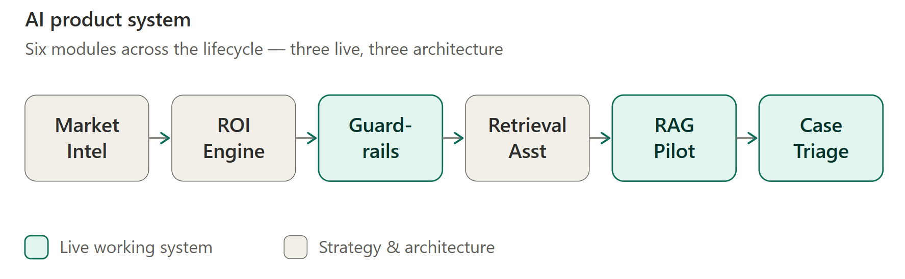
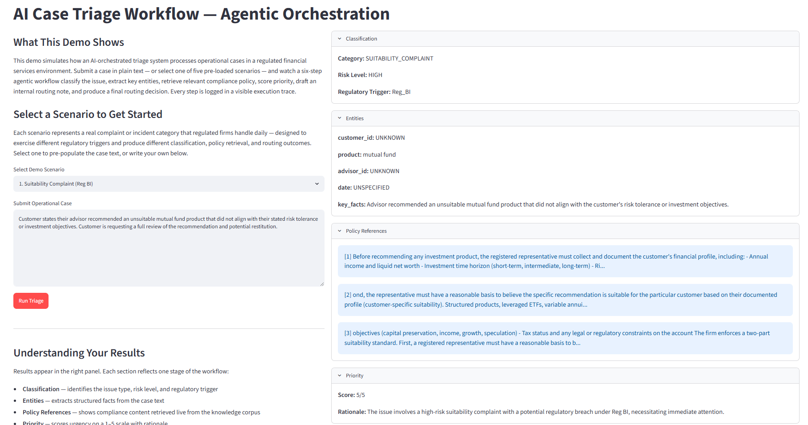
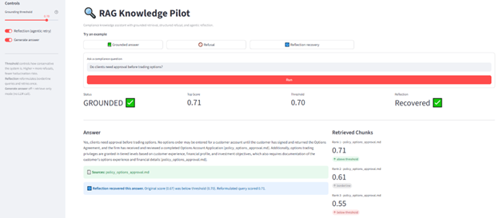
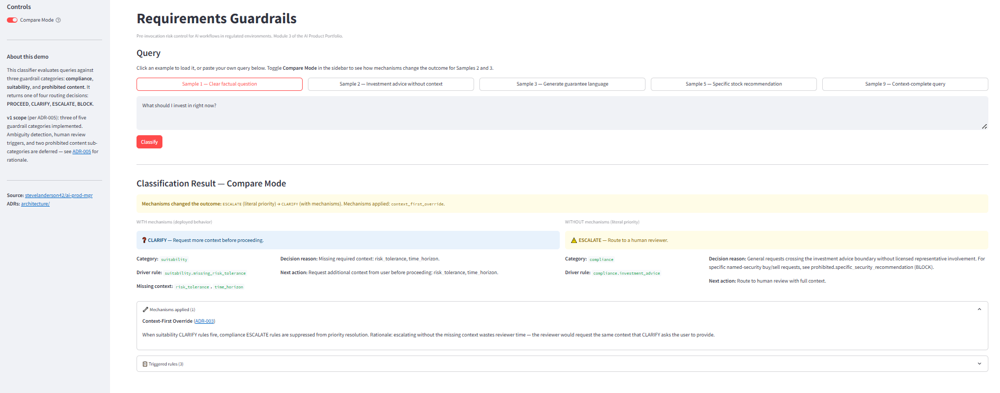

# AI Product Systems Portfolio | Steve L. Anderson

Senior Product Manager building agentic workflows, RAG systems, evaluation frameworks, and guardrails — paired with 20+ years of product experience in regulated financial services, including 12 years at Charles Schwab.

This portfolio is a set of working AI systems that translate LLM capabilities into the things products actually need: classification, retrieval, routing, escalation, grounded generation, execution tracing, and measurable quality controls. Three of the systems are live and interactive. The remaining work is the product strategy, architecture, and governance design that the working systems operate within — the controls that have to hold in environments like the one I came from.

<!-- IMAGE SLOT 1 — HERO / SYSTEM OVERVIEW (optional but high value)
     A single banner-style image directly under the intro gives a skimmer an instant "this is a system" impression.
     Best option: a clean horizontal diagram of the six-module flow (the same chain shown lower in this README),
     exported as a wide PNG (~1200x300). Could be a styled version of the Mermaid flow, or a Figma/draw.io export.
     Hero diagram of the six-module flow. -->


---

## Live Systems

Three working modules, each with a live demo.

### 🟢 AI Case Triage Workflow

A LangGraph six-node agentic pipeline. Live GPT-4o inference at five nodes — classification, entity extraction, priority scoring, internal note generation, and routing decision — plus a policy-retrieval node that consumes the RAG system below as a live tool, and a full execution trace on every run.

[](https://ai-case-triage-workflow.streamlit.app)

<!-- IMAGE SLOT 2 — CASE TRIAGE EXECUTION TRACE (highest priority screenshot)
     Screenshot of the live app showing a completed run: the six-node trace with real per-node
     input/output/rationale visible. This is the single strongest "it actually runs" proof on the page —
     a skimmer believes the build the moment they see a real execution trace.
     Lives in the module's own docs folder. -->


- Six-node LangGraph state machine with shared state flowing through every node
- Live GPT-4o inference at five nodes (classification, extraction, priority scoring, note generation, routing)
- Policy-retrieval node consumes the RAG Knowledge Pilot as a live workflow tool — a real cross-module dependency, not a standalone demo
- Full execution trace logging every node's input, output, and rationale
- Five regulatory scenarios (Reg BI, FINRA 2210, KYC/AML) exercising different pipeline paths

→ [Full README with sequence diagram and live demo](./modules/agentic-case-triage/)

### 🟢 RAG Knowledge Pilot

An embedding-based retrieval system with measured quality. An agentic reflection loop reformulates borderline queries and retries once — lifting the grounded-answer rate from 72.7% to 90.9% with zero loss in refusal correctness.

[](https://rag-knowledge-pilot.streamlit.app)

| Metric | Threshold 0.45 | Threshold 0.60 (no reflection) | Threshold 0.60 (with reflection) |
|---|---:|---:|---:|
| Grounded Answer Rate (GAR) | **100.0%** (11/11) | 72.7% (8/11) | **90.9%** (10/11) |
| Refusal Correctness Rate (RCR) | **100.0%** (4/4) | **100.0%** (4/4) | **100.0%** (4/4) |

<!-- IMAGE SLOT 3 — RAG RESULTS / EVALUATION VIEW (high priority screenshot)
     Screenshot of the live app showing either (a) a grounded answer with its citations, or
     (b) the evaluation harness output with the GAR/RCR numbers rendered. Option (b) reinforces the
     Lives in the module's own docs/screenshots folder. -->


- OpenAI embedding-based vector retrieval over a compliance policy corpus
- Categorical grounding decisions (GROUNDED / REFUSED) with structured reason codes — refusal treated as a first-class output, not an error
- Configurable grounding threshold to explore the precision/recall tradeoff
- Agentic reflection loop that reformulates borderline queries and retries once
- Evaluation harness computing GAR, RCR, and retrieval characteristics across 15 domain-realistic test queries

→ [Full README with diagrams, results, and quick start](./modules/rag-knowledge-pilot/)

### 🟢 Requirements Guardrails

A deterministic pre-invocation classifier that decides whether an AI request can safely proceed before any model is invoked, returning one of four routing decisions: PROCEED, CLARIFY, ESCALATE, or BLOCK. No general-purpose LLM at the decision boundary — every classification traces to a rule firing or a documented mechanism.

[](https://requirements-guardrails.streamlit.app)

<!-- IMAGE SLOT 4 — GUARDRAILS COMPARE MODE (high priority screenshot)
     Screenshot of the live demo's Compare Mode showing the same query producing two different
     routing decisions side by side (e.g. ESCALATE under literal routing vs CLARIFY once the
     context-first override applies). The side-by-side is the distinctive visual — it shows the
     Lives in the module's own docs folder. -->


- Deterministic routing with full audit trail on every decision, including rules suppressed by an override
- **Compare Mode** — a single toggle runs the classifier with and without its two governance mechanisms, side by side, so a reviewer sees exactly how the architecture changes the outcome
- Context-first override (ADR-003) — suppresses premature escalation when the request lacks context a human reviewer would need anyway
- Produce-intent upgrade (ADR-004) — distinguishes a request that *contains* prohibited language from one asking the system to *generate* it
- Deliberately scoped v1 (ADR-005) — three of five guardrail categories implemented, the other two deferred with documented reasoning
- 21 passing tests covering routing behavior and mechanism effects

→ [Full README with architecture diagrams, ADR index, and Compare Mode walkthrough](./modules/requirements-guardrails/)

---

## How It Fits Together

The six modules mirror how organizations evaluate, prioritize, design, govern, and deploy AI across a product lifecycle. The three live systems above are the working layer; the other three define the framework they run inside.

```
Market Intelligence → ROI Engine → Guardrails → Retrieval Assistant → RAG Knowledge Pilot → Case Triage Workflow
(surfaces             (prioritizes)  (pre-invocation (specifies            (operationalizes +     (orchestrates
 opportunities)                       control)        governance)           measures)              agentically)
```

What ties the working layer together is a real cross-module dependency, not three standalone demos: the Retrieval Assistant specifies the governance, the RAG Knowledge Pilot operationalizes and measures it, and the Case Triage Workflow consumes that retrieval as a tool inside a bounded agentic orchestration. Requirements Guardrails sits alongside this chain as the pre-invocation control — it governs what reaches a model at all.

<!-- IMAGE SLOT 5 — MODULE DEPENDENCY DIAGRAM (optional)
     If you want a rendered version of the chain above instead of the ASCII block, this is the spot.
     NOTE: if you have Mermaid source, you can embed it directly as a ```mermaid code block and GitHub
     renders it natively — no image file needed. Paste the Mermaid and I'll wire it in. Otherwise:
     Save a diagram export as ./docs/images/module-dependency.png and uncomment the line below. -->
<!--  -->

### The Full Six-Module Map

| Module | Layer | Purpose |
|--------|-------|---------|
| 1. [Market Intelligence Monitor](./modules/market-intelligence-monitor/) | Strategy & architecture | Tracks competitor AI releases and regulatory signals to inform strategic prioritization |
| 2. [ROI Decision Engine](./modules/roi-engine/) | Strategy & architecture | Structured, risk-aware framework for prioritizing AI opportunities |
| 3. [**Requirements Guardrails**](./modules/requirements-guardrails/) | ⚡ Live system | Pre-invocation control — deterministic routing with interactive Compare Mode |
| 4. [Compliance Retrieval Assistant](./modules/compliance-retrieval-assistant/) | Strategy & architecture | Governance architecture for citation-first retrieval in high-risk workflows |
| 5. [**RAG Knowledge Pilot**](./modules/rag-knowledge-pilot/) | ⚡ Live system | Measured retrieval — 90.9% grounded answer rate, 100% refusal correctness, agentic reflection |
| 6. [**AI Case Triage Workflow**](./modules/agentic-case-triage/) | ⚡ Live system | LangGraph six-node agentic pipeline with live policy retrieval and full execution trace |

---

## Why Reliability and Controls Matter

The controls these systems implement — grounded retrieval, refusal as a first-class output, escalation paths, deterministic routing, full audit traces — aren't abstract. They're the difference between an AI demo and an AI feature that can ship inside FINRA, SEC, and SR 11-7 constraints. That's the environment I spent 12 years in, and it's where this kind of building is hardest and most valuable.

Regulation operates as shared context that informs concrete design decisions across modules — auditability, traceability, escalation paths, defensible outputs. Representative regulations that shaped the systems:

| Regulation | What It Governs | Design Implication |
|------------|-----------------|---------------------|
| [SR 11-7](./regulatory-governance/finserv/sr-11-7-model-risk.md) | Model risk management | Documentation standards, validation artifacts |
| [FINRA 2210](./regulatory-governance/finserv/finra-2210-communications.md) | Communications with the public | Fair-and-balanced language checks in Guardrails |
| [SEC 17a-4](./regulatory-governance/finserv/sec-17a-4-books-records.md) | Books and records | Trace schema, immutable audit trails |
| [Reg BI](./regulatory-governance/finserv/reg-bi-suitability.md) | Suitability requirements | Mandatory clarification or refusal paths |

Full regulatory notes: [/regulatory-governance/](./regulatory-governance/)

---

## Credentials & Continuing Education

| Credential | Issuer | Status |
|---|---|---|
| Azure AI-900 — AI Fundamentals | Microsoft | ✅ Completed |
| AI Essentials | Google | ✅ Completed |
| Prompt Engineering for Developers | DeepLearning.AI | ✅ Completed |
| AI Agentic Design Patterns with AutoGen | DeepLearning.AI | ✅ Completed |
| AI Agents in LangGraph | DeepLearning.AI | ✅ Completed |

---

## Local Setup

- See `requirements.txt` for Python dependencies
- **Module 3 (Requirements Guardrails)** — runs with no external API; `streamlit run app.py` from the module folder, or use the [live demo](https://requirements-guardrails.streamlit.app)
- **Module 5 (RAG Knowledge Pilot)** — requires an OpenAI API key; see [Module 5 Setup](./modules/rag-knowledge-pilot/#setup)
- **Module 6 (AI Case Triage Workflow)** — requires an OpenAI API key; see [Module 6 Live Demo](./modules/agentic-case-triage/#live-demo)

Each module includes its own README documenting scope, design rationale, tradeoffs, and artifacts.