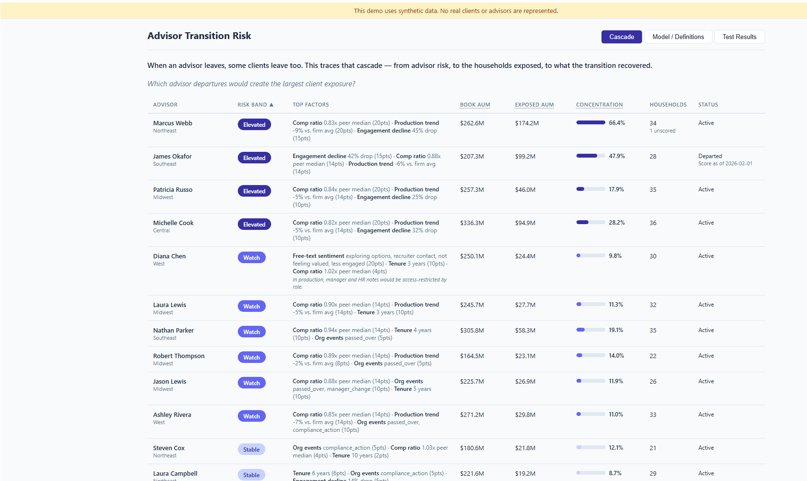

# AI Product Systems Portfolio | Steve L. Anderson

Senior Product Manager. I build and ship working AI systems — agentic workflows, retrieval with measured quality, decision scoring, and pre-invocation controls — drawing on 20+ years of enterprise product experience in regulated financial services, including 12 years at Charles Schwab.

Four of the systems here are live and interactive. The rest is the product strategy, architecture, and governance design the working systems operate within.


---

## Applied Product Systems

Domain product work built outside the six-module lifecycle below.

### 🟢 Advisor Transition Risk

Advisor attrition and client attrition are usually tracked as separate metrics. At a wealth-management firm where the client relationship sits with an individual advisor, they are one causal chain. This models that chain in three stages — which advisors may depart, which households would follow them out, and how much of the book a transition actually recovered.

[](https://stevelanderson42.github.io/advisor-transition-risk/)



- Two independent household scores — baseline departure risk and follow likelihood given a specific advisor's exit — because they're driven by different signals and imply different interventions
- Transparent additive scoring; every band decomposes into its contributing factors inline
- Explicit distinction between *missing* data and data that is *present but unreliable*, with the system declining to score rather than producing a confident number from nothing
- Python scoring engine computing offline; static React front end reading a fixed JSON payload — no server, no keys in client code
- Eleven designed test cases verifying the implementation against its specification

→ [Full README, including the decision log](./modules/advisor-transition-risk/)

---

## The Six-Module Lifecycle

Three working modules, each with a live demo, sitting inside a framework of three strategy and architecture modules.

### 🟢 AI Case Triage Workflow

A LangGraph six-node agentic pipeline. Live GPT-4o inference at five nodes — classification, entity extraction, priority scoring, internal note generation, and routing decision — plus a policy-retrieval node that consumes the RAG system below as a live tool, and a full execution trace on every run.

[](https://ai-case-triage-workflow.streamlit.app)


- Six-node LangGraph state machine with shared state flowing through every node
- Live GPT-4o inference at five nodes (classification, extraction, priority scoring, note generation, routing)
- Policy-retrieval node consumes the RAG Knowledge Pilot as a live workflow tool — a real cross-module dependency, not a standalone demo
- Full execution trace logging every node's input, output, and rationale
- Five regulatory scenarios (Reg BI, FINRA 2210, KYC/AML) exercising different pipeline paths

→ [Full README with sequence diagram and live demo](./modules/agentic-case-triage/)

### 🟢 RAG Knowledge Pilot

An embedding-based retrieval system with measured quality. An agentic reflection loop reformulates borderline queries and retries once — lifting the grounded-answer rate from 72.7% to 90.9% with zero loss in refusal correctness.

[](https://rag-knowledge-pilot.streamlit.app)

| Metric | Threshold 0.45 | Threshold 0.60 (no reflection) | Threshold 0.60 (with reflection) |
|---|---:|---:|---:|
| Grounded Answer Rate (GAR) | **100.0%** (11/11) | 72.7% (8/11) | **90.9%** (10/11) |
| Refusal Correctness Rate (RCR) | **100.0%** (4/4) | **100.0%** (4/4) | **100.0%** (4/4) |


- OpenAI embedding-based vector retrieval over a compliance policy corpus
- Categorical grounding decisions (GROUNDED / REFUSED) with structured reason codes — refusal treated as a first-class output, not an error
- Configurable grounding threshold to explore the precision/recall tradeoff
- Agentic reflection loop that reformulates borderline queries and retries once
- Evaluation harness computing GAR, RCR, and retrieval characteristics across 15 domain-realistic test queries

→ [Full README with diagrams, results, and quick start](./modules/rag-knowledge-pilot/)

### 🟢 Requirements Guardrails

A deterministic pre-invocation classifier that decides whether an AI request can safely proceed before any model is invoked, returning one of four routing decisions: PROCEED, CLARIFY, ESCALATE, or BLOCK. No general-purpose LLM at the decision boundary — every classification traces to a rule firing or a documented mechanism.

[](https://requirements-guardrails.streamlit.app)


- Deterministic routing with full audit trail on every decision, including rules suppressed by an override
- **Compare Mode** — a single toggle runs the classifier with and without its two governance mechanisms, side by side, so a reviewer sees exactly how the architecture changes the outcome
- Context-first override (ADR-003) — suppresses premature escalation when the request lacks context a human reviewer would need anyway
- Produce-intent upgrade (ADR-004) — distinguishes a request that *contains* prohibited language from one asking the system to *generate* it
- Deliberately scoped v1 (ADR-005) — three of five guardrail categories implemented, the other two deferred with documented reasoning
- 21 passing tests covering routing behavior and mechanism effects

→ [Full README with architecture diagrams, ADR index, and Compare Mode walkthrough](./modules/requirements-guardrails/)

---

## How the Six Fit Together

The six modules mirror how organizations evaluate, prioritize, design, govern, and deploy AI across a product lifecycle. The three live systems above are the working layer; the other three define the framework they run inside.

```
Market Intelligence → ROI Engine → Guardrails → Retrieval Assistant → RAG Knowledge Pilot → Case Triage Workflow
(surfaces             (prioritizes)  (pre-invocation (specifies            (operationalizes +     (orchestrates
 opportunities)                       control)        governance)           measures)              agentically)
```

What ties the working layer together is a real cross-module dependency, not three standalone demos: the Retrieval Assistant specifies the governance, the RAG Knowledge Pilot operationalizes and measures it, and the Case Triage Workflow consumes that retrieval as a tool inside a bounded agentic orchestration. Requirements Guardrails sits alongside this chain as the pre-invocation control — it governs what reaches a model at all.

### The Full Module Map

| Module | Layer | Purpose |
|--------|-------|---------|
| [**Advisor Transition Risk**](./modules/advisor-transition-risk/) | ⚡ Live system | Standalone — advisor departure risk and the client exposure it creates |
| 1. [Market Intelligence Monitor](./modules/market-intelligence-monitor/) | Strategy & architecture | Tracks competitor AI releases and regulatory signals to inform strategic prioritization |
| 2. [ROI Decision Engine](./modules/roi-engine/) | Strategy & architecture | Structured, risk-aware framework for prioritizing AI opportunities |
| 3. [**Requirements Guardrails**](./modules/requirements-guardrails/) | ⚡ Live system | Pre-invocation control — deterministic routing with interactive Compare Mode |
| 4. [Compliance Retrieval Assistant](./modules/compliance-retrieval-assistant/) | Strategy & architecture | Governance architecture for citation-first retrieval in high-risk workflows |
| 5. [**RAG Knowledge Pilot**](./modules/rag-knowledge-pilot/) | ⚡ Live system | Measured retrieval — 90.9% grounded answer rate, 100% refusal correctness, agentic reflection |
| 6. [**AI Case Triage Workflow**](./modules/agentic-case-triage/) | ⚡ Live system | LangGraph six-node agentic pipeline with live policy retrieval and full execution trace |

---

## Why Reliability and Controls Matter

The controls these systems implement — grounded retrieval, refusal as a first-class output, escalation paths, deterministic routing, full audit traces — aren't abstract. They're the difference between an AI demo and an AI feature that can ship inside FINRA, SEC, and SR 11-7 constraints. That's the environment I spent 12 years in, and it's where this kind of building is hardest and most valuable.

Regulation operates as shared context that informs concrete design decisions across modules — auditability, traceability, escalation paths, defensible outputs. Representative regulations that shaped the systems:

| Regulation | What It Governs | Design Implication |
|------------|-----------------|---------------------|
| [SR 11-7](./regulatory-governance/finserv/sr-11-7-model-risk.md) | Model risk management | Documentation standards, validation artifacts |
| [FINRA 2210](./regulatory-governance/finserv/finra-2210-communications.md) | Communications with the public | Fair-and-balanced language checks in Guardrails |
| [SEC 17a-4](./regulatory-governance/finserv/sec-17a-4-books-records.md) | Books and records | Trace schema, immutable audit trails |
| [Reg BI](./regulatory-governance/finserv/reg-bi-suitability.md) | Suitability requirements | Mandatory clarification or refusal paths |

Full regulatory notes: [/regulatory-governance/](./regulatory-governance/)

---

## Credentials & Continuing Education

| Credential | Issuer | Status |
|---|---|---|
| Azure AI-900 — AI Fundamentals | Microsoft | ✅ Completed |
| AI Essentials | Google | ✅ Completed |
| Prompt Engineering for Developers | DeepLearning.AI | ✅ Completed |
| AI Agentic Design Patterns with AutoGen | DeepLearning.AI | ✅ Completed |
| AI Agents in LangGraph | DeepLearning.AI | ✅ Completed |

---

## Local Setup

- See `requirements.txt` for Python dependencies
- **Advisor Transition Risk** — Python generator plus a Vite front end; see [module README](./modules/advisor-transition-risk/) or the [live demo](https://stevelanderson42.github.io/advisor-transition-risk/)
- **Requirements Guardrails** — runs with no external API; `streamlit run app.py` from the module folder, or use the [live demo](https://requirements-guardrails.streamlit.app)
- **RAG Knowledge Pilot** — requires an OpenAI API key; see [setup instructions](./modules/rag-knowledge-pilot/#setup)
- **AI Case Triage Workflow** — requires an OpenAI API key; see [live demo](./modules/agentic-case-triage/#live-demo)

Each module includes its own README documenting scope, design rationale, tradeoffs, and artifacts.

---

[Portfolio](https://stevelanderson42.github.io) · [LinkedIn](https://www.linkedin.com/in/steve-l-anderson-1a16391/) · stevelanderson.42@gmail.com