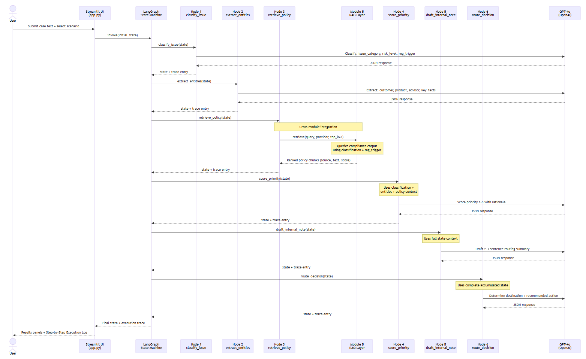
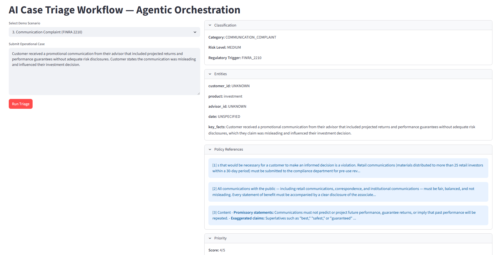

# Module 6 — AI Case Triage Workflow (Agentic Orchestration)

> **10-Second Summary:**
> Module 6 orchestrates multi-step AI triage workflows — classifying, enriching,
> retrieving policy, and routing decisions with a full execution trace — demonstrating
> how governed agentic systems operate in regulated environments.

[](https://ai-case-triage-workflow.streamlit.app)

---

## What This Module Does

This module simulates how a regulated financial services company triages operational
cases (complaints, disputes, incidents) using a bounded, auditable AI workflow.

A user submits a case in plain text. The system runs it through a six-node LangGraph
state machine — classifying the issue, extracting key entities, retrieving relevant
policy, scoring priority, drafting an internal routing note, and producing a final
routing decision.

Every step is logged. Every decision is traceable. Nothing is a black box.

---

## Why This Matters (Portfolio Context)

Most AI demos show a chatbot that answers questions.

This module shows something different:

- A **multi-step AI workflow** with explicit state management
- **Tool-using orchestration** via LangGraph nodes
- **Policy retrieval** consumed from the Module 5 RAG layer as a workflow tool
- **Execution trace** exposing every node's input, output, and rationale
- **Routing logic** that produces a structured, actionable output

> Module 6 consumes Module 5's retrieval layer as a tool within an orchestrated
> workflow. This is not a standalone demo — it is an architecture.

---

## System Architecture

The workflow executes as a six-node LangGraph state machine.
Each node reads accumulated state, performs its function
(LLM call or retrieval), appends a trace entry, and passes
enriched state to the next node.

Node 3 is the cross-module integration point: it directly
imports and executes the Module 5 RAG retrieval layer,
querying the compliance corpus using a classification-derived
query and returning ranked policy chunks that feed into all
downstream nodes.



*The execution trace visible in the Streamlit UI mirrors
this sequence exactly — every node's input and output
is logged in real time.*

```
User Input (plain text case)
        ↓
┌─────────────────────────────┐
│   LangGraph State Machine   │
│                             │
│  Node 1: classify_issue     │  → issue type, risk category
│  Node 2: extract_entities   │  → customer, product, dates, facts
│  Node 3: retrieve_policy    │  → policy snippets (Module 5 RAG layer)
│  Node 4: score_priority     │  → urgency score + rationale
│  Node 5: draft_internal_note│  → structured routing summary
│  Node 6: route_decision     │  → final routing + recommended action
└─────────────────────────────┘
        ↓
Structured Output + Full Execution Trace
```

**Shared state flows through every node.** Each node reads what it needs,
adds what it produces. Nothing is lost between steps.

---

## Live Demo

[](https://ai-case-triage-workflow.streamlit.app)


*Six-node triage pipeline output with execution trace —
Classification, Entities, Policy References, Priority,
Internal Note, and Routing Decision displayed in
expandable sections with full audit trail.*

---

## Regulatory Anchors

Case scenarios are designed around real FinServ operational triggers:

| Trigger | Regulatory Reference |
|---|---|
| Suitability complaint | Reg BI / FINRA Rule 2111 |
| Communication dispute | FINRA Rule 2210 |
| Unauthorized transaction | KYC / AML workflow |
| Disclosure failure | SEC / Reg BI |
| Escalation threshold | SR 11-7 model risk alignment |

---

## Execution Trace (Audit by Design)

Every node appends to a running trace log:

```
Node 1 — classify_issue
  Input:  "Customer states advisor recommended unsuitable product..."
  Output: category=SUITABILITY_COMPLAINT, risk_level=HIGH, reg_trigger=Reg_BI

Node 2 — extract_entities
  Input:  [raw case text]
  Output: customer_id=implied, product=mutual_fund, advisor_id=implied, date=recent

Node 3 — retrieve_policy
  Input:  category=SUITABILITY_COMPLAINT
  Output: FINRA Rule 2111 snippet, Reg BI obligation summary

...and so on through Node 6.
```

This trace is displayed in the Streamlit UI alongside the final output.
It proves the system is transparent, auditable, and governable — not just functional.

---

## Demo Scenarios (Synthetic)

Five representative cases designed to exercise different triage paths:

| # | Scenario | Expected Path |
|---|---|---|
| 1 | Suitability complaint on product recommendation | Reg BI → compliance review |
| 2 | Unauthorized transaction dispute | fraud → escalation |
| 3 | Communication/disclosure complaint | FINRA 2210 → documentation review |
| 4 | Account access / fraud report | security → immediate escalation |
| 5 | Fee dispute with escalation flag | ops → supervisor review |

---

## Tech Stack

| Component | Technology |
|---|---|
| Orchestration | LangGraph |
| LLM | OpenAI GPT-4o (via LangChain) |
| Policy Retrieval | Module 5 RAG layer (ChromaDB) |
| UI | Streamlit |
| State Management | LangGraph TypedDict state |
| Audit Logging | Execution trace (per-node JSON) |

---

## Portfolio Connection

| Module | Role in System |
|---|---|
| Module 3 — Requirements Guardrails | Pre-invocation risk control |
| Module 4 — Compliance RAG | Governed execution layer |
| Module 5 — RAG Knowledge Pilot | Retrieval layer consumed by Module 6 |
| **Module 6 — AI Case Triage Workflow (Agentic Orchestration)** | **Agentic orchestration + runtime trace** |

---

## Status

✅ Live Demo: https://ai-case-triage-workflow.streamlit.app

