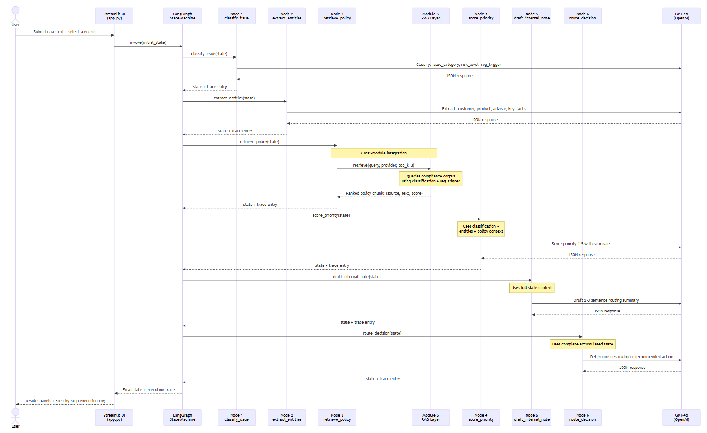
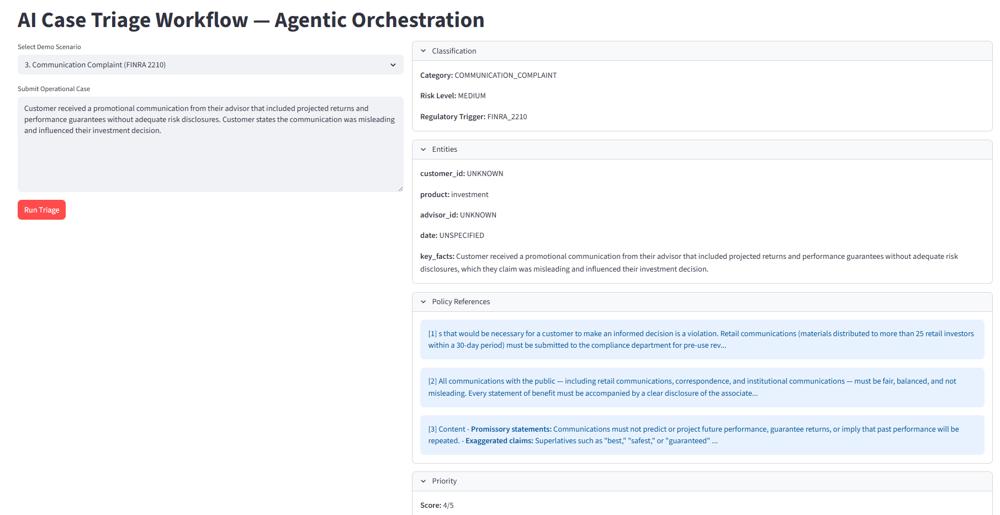

# Module 6 — AI Case Triage Workflow (Agentic Orchestration)

> **10-Second Summary:**
> A fully deployed, agentic AI workflow that classifies operational cases, retrieves
> policy from a governed RAG layer, and routes decisions with a complete execution
> trace — demonstrating how production AI systems operate in regulated environments.

[](https://ai-case-triage-workflow.streamlit.app)

Click the "Live Demo" ribbon above to run the demo.

---

## What This Module Does

This module simulates a real-world operational triage system used in regulated financial services.

A user submits a case in plain text. The system executes a six-step workflow: classification, entity extraction, policy retrieval, priority scoring, internal note generation, and routing decision.

Each step operates on shared state, and every decision is logged in a visible execution trace.

The result is a structured, auditable output — not just a generated response.

---

## Why This Matters (Portfolio Context)

Most AI demos show a chatbot that answers questions. Module 6 shows something different — a bounded agentic workflow that produces an auditable operational decision, composed from named architectural layers rather than from a single model call.

What this module makes visible:

- A **multi-step AI workflow** with explicit state management and shared state passed between nodes
- **Tool-using orchestration** via LangGraph nodes — bounded, not open-ended
- **Policy retrieval** consumed from the Module 5 RAG layer, which itself operationalizes Module 4's governance specification
- **Execution trace** exposing every node's input, output, and rationale — the audit trail is the architecture, not a feature
- **Routing logic** that produces a structured, actionable output, not generated prose

> Module 6 consumes Module 5's retrieval layer as a tool within an orchestrated
> workflow — and Module 5 itself executes the governance architecture
> specified in Module 4. This is not a standalone demo. It is the most
> downstream layer of a deliberately composed architectural chain.

---

## System Architecture

The workflow executes as a six-node LangGraph state machine.
Each node reads accumulated state, performs its function
(LLM call or retrieval), appends a trace entry, and passes
enriched state to the next node.

Node 3 is the system's integration point with the Module 5 RAG layer,
which itself operationalizes the governance principles specified in
Module 4 (Compliance Retrieval Assistant). The workflow dynamically
queries a versioned compliance corpus using a classification-derived
query. The retrieved policy directly influences priority scoring,
internal note generation, and routing decisions — creating a true
system dependency, not a standalone demo.

The architectural chain runs **Module 4 → Module 5 → Module 6**:
Module 4 defines the control-plane thinking and refusal taxonomy.
Module 5 executes retrieval behavior and measures it. Module 6 consumes
Module 5's retrieval as a tool inside an orchestrated, traceable workflow.
Each layer in the chain has a distinct architectural role.



*The execution trace visible in the Streamlit UI mirrors
this sequence exactly — every node's input and output
is logged in real time.*

```
User Input (plain text case)
        ↓
┌─────────────────────────────┐
│   LangGraph State Machine   │
│                             │
│  Node 1: classify_issue     │  → issue type, risk category
│  Node 2: extract_entities   │  → customer, product, dates, facts
│  Node 3: retrieve_policy    │  → policy snippets (Module 5 RAG layer)
│  Node 4: score_priority     │  → urgency score + rationale
│  Node 5: draft_internal_note│  → structured routing summary
│  Node 6: route_decision     │  → final routing + recommended action
└─────────────────────────────┘
        ↓
Structured Output + Full Execution Trace
```

**Shared state flows through every node.** Each node reads what it needs,
adds what it produces. Nothing is lost between steps.

---

## Live Demo


*Six-node triage pipeline output with execution trace —
Classification, Entities, Policy References, Priority,
Internal Note, and Routing Decision displayed in
expandable sections with full audit trail. Click the **Live Demo**
ribbon at the top of this README to run the full workflow.*

---

## Regulatory Anchors

Case scenarios are designed around real FinServ operational triggers:

| Trigger | Regulatory Reference |
|---|---|
| Suitability complaint | Reg BI / FINRA Rule 2111 |
| Communication dispute | FINRA Rule 2210 |
| Unauthorized transaction | KYC / AML workflow |
| Disclosure failure | SEC / Reg BI |
| Escalation threshold | SR 11-7 model risk alignment |

---

## Execution Trace (Audit by Design)

Every node appends to a running trace log:

```
Node 1 — classify_issue
  Input:  "Customer states advisor recommended unsuitable product..."
  Output: category=SUITABILITY_COMPLAINT, risk_level=HIGH, reg_trigger=Reg_BI

Node 2 — extract_entities
  Input:  [raw case text]
  Output: customer_id=implied, product=mutual_fund, advisor_id=implied, date=recent

Node 3 — retrieve_policy
  Input:  query="SUITABILITY_COMPLAINT Reg_BI compliance policy"
  Output: FINRA Rule 2111 snippet, Reg BI obligation summary

...and so on through Node 6.
```

This trace is displayed in the Streamlit UI alongside the final output.
It proves the system is transparent, auditable, and governable — not just functional.

---

## Demo Scenarios (Synthetic)

Five representative cases designed to exercise different triage paths:

| # | Scenario | Expected Path |
|---|---|---|
| 1 | Suitability complaint on product recommendation | Reg BI → compliance review |
| 2 | Unauthorized transaction dispute | fraud → escalation |
| 3 | Communication/disclosure complaint | FINRA 2210 → documentation review |
| 4 | Account access / fraud report | security → immediate escalation |
| 5 | Fee dispute with escalation flag | ops → supervisor review |

---

## What This Demonstrates

- Composing **architectural layers** — Module 4 (governance specification), Module 5 (operationalized retrieval), Module 6 (orchestrated consumer) — into a deliberate chain rather than a monolithic system
- Designing **bounded agentic workflows** with explicit state and named nodes, instead of open-ended agents
- Integrating **retrieval systems as tools inside orchestration**, with the retrieval layer governed by separate architectural principles
- Combining **LLM reasoning with deterministic control logic** — the LLM decides what's in each node, the state machine decides which nodes run
- Building **auditable AI systems** where the execution trace is the architecture, not an afterthought
- Deploying **end-to-end AI workflows to production** on Streamlit Cloud

---

## Tech Stack

| Component | Technology |
|---|---|
| Orchestration | LangGraph |
| LLM | OpenAI GPT-4o (via LangChain) |
| Policy Retrieval | Module 5 RAG layer (ChromaDB) |
| UI | Streamlit |
| State Management | LangGraph TypedDict state |
| Audit Logging | Execution trace (per-node JSON) |

---

## Portfolio Connection

| Module | Status | Role in the toolkit |
|--------|--------|---------------------|
| 1. Market Intelligence Monitor | 📄 Design artifact | External signal awareness — what AI initiatives should the firm consider |
| 2. ROI Decision Engine | 📄 Design artifact | Structured prioritization — which initiatives are worth pursuing |
| 3. Requirements Guardrails | ⚡ Working classifier + live demo | Pre-invocation control — should this request proceed, and with what context |
| 4. Compliance Retrieval Assistant | 📘 Architectural specification | In-flight retrieval and output governance — grounded responses with citation and refusal |
| 5. RAG Knowledge Pilot | ⚡ Working pilot + live demo | Executable proof of Module 4's principles — measured retrieval, structured refusal, agentic recovery |
| **▶ 6. AI Case Triage Workflow** (this module) | ⚡ **Working agent + live demo** | **Agentic orchestration that consumes Module 5's retrieval as a tool inside a six-node state machine** |

The portfolio organizes around two veins:

- **Builder vein** (Modules 3, 5, 6) — shipped, tested, deployed systems with interactive demos
- **Governance vein** (Modules 1, 2, 4) — design artifacts and architectural specifications

Module 6 is the most downstream layer of the architectural chain that begins with Module 4 (control-plane specification), is operationalized in Module 5 (measured retrieval), and consumed as a tool by this module's orchestration. The three modules are not interchangeable — each plays a distinct role in the chain.

---

## Closing Note

Module 6 demonstrates a different kind of AI system: not a chatbot that
answers questions, but a bounded agentic workflow that produces an auditable
operational decision. The six-node state machine, the policy retrieval
consumed from Module 5's governed RAG layer, and the runtime execution trace
together demonstrate what production AI looks like in regulated environments
— deliberate, traceable, and composed of named architectural layers rather
than monolithic generation.

The most important property is the execution trace: every node's input,
output, and rationale is visible. A reviewer, auditor, or operator can
inspect any decision and trace it back to source. This is what makes the
system governable, not merely functional.

Module 6 sits as the most downstream layer of an architectural chain that
begins as governance specification (Module 4), is operationalized as
measured retrieval (Module 5), and is consumed here as a tool inside a
deliberately bounded orchestration. The chain is the architecture.

---

✅ **Live demo:** https://ai-case-triage-workflow.streamlit.app
✅ **Architecture:** Six-node LangGraph state machine
✅ **Composition:** Module 4 → Module 5 → Module 6 (chain)
✅ **Status:** Shipped

*Part of the Regulated AI Workflow Toolkit — demonstrating governance-first AI product design for regulated industries.*

