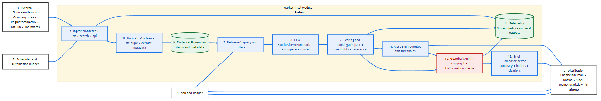

# Market Intelligence Monitor

## What This Module Is

The Market Intelligence Monitor represents the **external strategic awareness layer** of a regulated AI product system.

Its purpose is to continuously track **external signals**—such as competitor AI releases, regulatory developments, and industry adoption patterns—so that AI initiatives are grounded in **market reality**, not hype or internal enthusiasm.

This module exists to answer a foundational question that many AI programs skip:

> *"Why should we build this AI capability now?"*

---

## Why This Matters in Regulated Environments

In regulated industries, AI initiatives carry **asymmetric risk**:

- moving too slowly can erode competitive position
- moving too quickly can trigger regulatory, legal, or reputational damage

Unlike consumer tech, regulated organizations cannot afford to "ship and iterate" without context.

This module helps organizations:

- avoid chasing high-visibility but low-viability AI trends
- understand how peers and competitors are deploying AI responsibly
- anticipate regulatory direction before it becomes enforcement
- align AI strategy with risk tolerance and governance posture

In short, it prevents AI investment decisions from being driven by hype, fear, or isolated internal champions.

---

## Key Decisions This Module Enables

This module supports decisions such as:

- Which AI capabilities are becoming **table stakes** versus true differentiators
- When competitive pressure justifies AI investment
- Which regulatory signals should accelerate or pause initiatives
- Where internal AI proposals may be misaligned with market or policy reality

These decisions are typically owned by **Product Leadership**, **Strategy**, and **Executive Sponsors**, with input from Risk and Compliance.

---

## How This Module Fits Into the Overall System

The Market Intelligence Monitor is the **entry point** to the Regulated AI Workflow Toolkit.

Insights from this module feed directly into the **ROI Decision Engine**, where opportunities are evaluated more rigorously for value, feasibility, and regulatory complexity.

By design, no AI initiative advances without first passing through this external reality check.

This module includes a lightweight code scaffold to support repeatable signal ingestion, normalization, and synthesis over time; implementation is intentionally incremental.

> **System-Level Standards:** This module follows the evidence traceability and schema versioning patterns defined in [`/architecture/decisions/`](../../architecture/decisions/).

---

## Product Scope & PM Decisions (MVP)

This section documents explicit product decisions made during development of the Market Intelligence Monitor MVP.  
Decisions are recorded to demonstrate scope control, trade-off reasoning, and acceptance criteria — not to drive runtime behavior.

### Decision Index

| Decision ID | Area        | Summary                                              | Status   |
|------------|-------------|------------------------------------------------------|----------|
| MID-001    | Scope       | Limit MVP to 2–3 representative signal sources       | Approved |
| MID-002    | Sources     | Include Fidelity press releases (list-level only)    | Approved |
| MID-003    | Sources     | Include FINRA RSS as regulatory signal source        | Approved |
| MID-004    | Hydration   | Defer detail-page hydration pending decision value   | Approved |

### MVP Gating Decisions

| Decision Area | Decision | Rationale |
|--------------|----------|-----------|
| Source Scope | Limit MVP to a small number of representative sources | Validates decision usefulness without incurring high ingestion complexity |
| Source Mix | Include at least one market-driven source | Ensures competitive and industry pressure signals are represented |
| Ingestion Depth | Prioritize listing-level ingestion over full detail hydration | Sufficient for market timing and trend detection in MVP |
| Robustness Threshold | Defer hardening once acceptance criteria are met | Marginal robustness gains do not justify additional MVP cost |

---

### Source Decisions (MVP)

#### Fidelity Investments — Market Signal Source

**Decision:** Included in MVP

**Rationale:**
- High credibility and frequent publication cadence
- Representative example of a corporate newsroom source
- Direct relevance to competitive and industry signaling in regulated financial services

**MVP Acceptance Criteria (Met):**
- Stable, deduplicated signal identifiers
- Canonical publication dates captured
- Traceable raw evidence preserved
- Normalized signals suitable for downstream synthesis

**Close-Out Statement:**
> Fidelity ingestion meets MVP acceptance criteria for market-intel signal capture. Further robustness improvements are deferred pending demonstrated decision value and scale requirements.

**Scope Note:**
> Fidelity signals are excluded from retrieval and synthesis because MVP ingestion was list-level only (no detail-page hydration). Fidelity can inform signal awareness but not synthesis. Full Fidelity hydration deferred pending decision value from FINRA synthesis.

---

#### FINRA — Regulatory Signal Source

**Decision:** Included in MVP (constrained scope)

**Rationale:**
- Authoritative regulatory body with direct influence on financial services behavior
- High signal-to-noise for compliance posture, enforcement trends, and supervisory priorities
- Provides necessary regulatory counterbalance to market-driven sources (e.g., Fidelity)

**MVP Scope Constraints:**
- Source treated as **low-frequency, high-impact**
- Ingestion prioritized for **official notices, rule updates, and guidance**
- Full historical backfill and deep semantic parsing explicitly deferred

**MVP Acceptance Criteria (Met):**
- Reliable capture of published title, date, and canonical URL
- Clear source attribution (FINRA)
- Traceable raw evidence preserved
- Normalized signals suitable for regulatory posture synthesis
- Detail-page hydration with extracted article text
- LLM-generated summaries for decision support

**Close-Out Statement:**
> FINRA RSS ingestion meets MVP acceptance criteria (stable feed, parseable titles/dates/URLs, deterministic signal IDs, evidence traceability). Full pipeline validated through synthesis.

**MID-004 Implementation Note:**
> Initial hydration attempt produced zero extracted text due to an environment-dependent parsing assumption (`Invoke-WebRequest.ParsedHtml`). Replaced with deterministic HTML title parsing while maintaining evidence traceability.

---

#### Deferred Sources

Additional candidate sources were evaluated but intentionally deferred from the MVP due to ingestion complexity, low update cadence, or limited incremental decision value.

These sources may be reconsidered in future iterations once MVP signal synthesis demonstrates clear downstream impact.

---

### Step 7 — Retrieval Criteria (MVP)

**Use Case:** Weekly regulatory awareness brief for compliance teams

**Retrieval Scope:**
- Source: FINRA only (MVP)
- Time window: Last 30 days
- Filter: All hydrated signals (no keyword filtering in MVP)

**Rationale:**
MVP retrieval is intentionally broad to validate synthesis quality before investing in sophisticated filtering. Relevance scoring deferred to Step 9.

---

### Step 8 — LLM Synthesis (MVP)

**Purpose:** Transform retrieved signals into decision-useful summaries for compliance teams.

**Implementation:**
- Model: GPT-3.5-turbo
- Prompt: Regulatory intelligence analyst persona
- Output: 2-3 sentence summary per signal (action taken, who affected, compliance relevance)

**MVP Acceptance Criteria (Met):**
- All retrieved signals successfully summarized
- Summaries are factual, concise, and compliance-focused
- Full traceability from synthesis → retrieval → hydrated → normalized → raw evidence

**Close-Out Statement:**
> Synthesis validates end-to-end pipeline from external source to decision-useful output. Advanced features (hallucination checks, citation grounding, comparative analysis) deferred to Steps 9-10.

### Step 10 — Guardrails (MVP)

**Purpose:** Validate synthesis quality before trusting LLM-generated output.

**Checks Performed:**
| Check | Purpose | Method |
|-------|---------|--------|
| Grounding | Is summary based on source text? | LLM verification |
| Citation | Valid source URL? | Pattern match |
| PII | Any personal info leaked? | Regex patterns |
| Content | Appropriate length/format? | Heuristics |

**MVP Acceptance Criteria (Met):**
- All synthesized signals validated against source evidence
- Grounding check confirms no hallucinated claims
- No PII or content flag violations
- Full report with per-signal pass/warn/fail status

**Output Location:** `data/signals/guardrails/`

**Close-Out Statement:**
> Guardrails validate that LLM synthesis is trustworthy before stakeholder delivery. This addresses the core governance requirement in regulated AI: outputs must be auditable and grounded in source evidence.

### Step 13 — Brief Composer (MVP)

**Purpose:** Transform synthesis output into a stakeholder-ready document for compliance teams.

**Output Format:** Markdown brief containing:
- Executive summary with auto-detected themes
- Individual signal summaries with source links
- Traceability metadata (brief ID, source files, schema versions)

**MVP Acceptance Criteria (Met):**
- Brief generated from synthesis output
- All signals included with summaries and citations
- Themes automatically extracted from content
- Full traceability to upstream artifacts

**Output Location:** `data/briefs/`

**Close-Out Statement:**
> Brief Composer produces a tangible, stakeholder-ready deliverable that demonstrates end-to-end value from external source to decision-support document.

---

## Entry Artifacts (Curated)

This module intentionally separates **decision-facing artifacts** from raw research.

### Context Diagram

High-level system flow showing how market signals enter the regulated AI workflow:

### Data Pipeline Artifacts

The MVP pipeline produces artifacts at each stage:

| Stage | Location | Schema |
|-------|----------|--------|
| Raw Evidence | `data/evidence/raw/` | RSS snapshots, HTML detail pages |
| Parsed Evidence | `data/evidence/parsed/` | Extracted/normalized records |
| Normalized Signals | `data/signals/raw/` | `normalized_signal.v1` |
| Hydrated Signals | `data/signals/hydrated/` | `hydrated_signal.v1` |
| Retrieval Sets | `data/signals/retrieval/` | `retrieval_set.v1` |
| Synthesis Output | `data/signals/synthesis/` | `synthesis_output.v1` |
| **Guardrails** | `data/signals/guardrails/` | `guardrails_report.v1` |
| Briefs | `data/briefs/` | Markdown regulatory briefs |

### Configuration & Signal Definitions

Source and categorization scaffolding used to structure incoming external signals.  
→ [`config/`](config/)

### Working Notes

Additional working notes and evolving structures live in:

- [`../../market-intel/`](../../market-intel/) — exploratory research, raw signal analysis, and drafts

---

## What This Module Is Not

This module does **not**:

- approve AI initiatives
- calculate ROI or feasibility
- replace compliance, legal, or risk review
- act as an execution engine for AI workloads

Its role is to ensure those downstream decisions are informed by **external reality** before significant investment or risk is assumed.

---

## Where to Go Deeper

For additional context and supporting material:

- [`../../market-intel/`](../../market-intel/) — working notes, evolving structures, and raw signal analysis
- [`../../architecture/decisions/`](../../architecture/decisions/) — system-level ADRs and standards
- Public Notion Portfolio — strategic framing and cross-module connections

---

## Status

**MVP Complete** (December 2025)

The Market Intelligence Monitor MVP demonstrates a working end-to-end pipeline:

✅ External source ingestion (Fidelity list-level, FINRA full hydration)  
✅ Evidence traceability at every stage  
✅ Retrieval filtering by source and time window  s
✅ LLM-powered synthesis producing decision-useful summaries  

Future iterations may add:
- Additional sources (pending decision value validation)
- Relevance scoring and ranking (Step 9)
- Guardrails and hallucination checks (Step 10)
- Brief composition and distribution (Steps 12-13)

This module is intentionally lightweight, reflecting its role as a **strategic input** rather than a delivery engine.