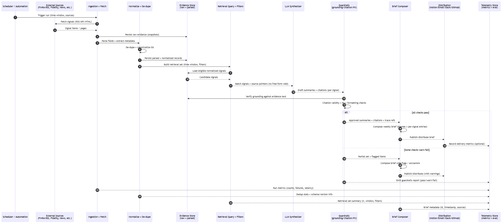

# Market Intelligence Monitor  
**External Signal Awareness for Regulated AI Strategy**

**Status:** 🟢 MVP Complete  
**Module:** 1 of 4 in the Regulated AI Workflow Toolkit

---

## Purpose

The Market Intelligence Monitor represents the **external strategic awareness layer** of a regulated AI product system.

Its role is to continuously track **market, regulatory, and industry signals** — such as competitor AI launches, regulatory guidance, enforcement actions, and adoption patterns — so that AI initiatives are grounded in **external reality**, not internal enthusiasm or hype.

**Core question this module answers:**

> *“Why should we build this AI capability now?”*

Most AI programs skip this step.  
Regulated organizations cannot afford to.

---

## The Problem This Solves

In regulated environments, AI initiatives carry **asymmetric risk**:

- Moving too slowly can erode competitive position  
- Moving too quickly can trigger regulatory, legal, or reputational damage  

Unlike consumer tech, regulated firms cannot “ship and iterate” without context.

Without disciplined market intelligence:

- AI investments chase headlines rather than viability  
- Regulatory signals are discovered *after* enforcement  
- Internal champions over-index on novelty  
- Leadership lacks a defensible rationale for timing  

This module ensures AI strategy is informed by **external signals before internal momentum builds**.

---

## Where It Sits in the Workflow

**[Market Intelligence] → ROI Engine → Guardrails → RAG Assistant**  
*(external signals) → (prioritizes) → (validates) → (executes)*

**This module:**
- Surfaces market pressure, regulatory posture, and peer behavior
- Provides evidence-backed inputs for downstream prioritization

**Downstream:**
- Feeds the **ROI Decision Engine**, where opportunities are evaluated for value, feasibility, and regulatory complexity

**PM DECISION:**  
No AI initiative advances into prioritization without first passing through this external reality check.

---

## Architecture Overview

### Context Diagram (System-in-the-World)

This diagram shows how external signals enter the regulated AI workflow, the governance boundaries applied during ingestion and synthesis, and how outputs feed downstream decision-making.

Design constraints applied during signal ingestion and synthesis are informed by shared regulatory expectations documented in the central [Regulatory Context](../../regulatory-governance/); this module references that context to preserve traceability without embedding legal interpretation.

---

## Sequence Diagram (Signal Lifecycle)

*End-to-end flow showing how external market and regulatory signals move from ingestion to validated, stakeholder-ready intelligence.*

### High-Level Flow

1. **Scheduled Trigger**  
   A scheduler or automation runner initiates a run based on a defined cadence (e.g., weekly).

2. **Signal Ingestion**  
   External sources (FINRA RSS, corporate newsrooms, industry feeds) are fetched.  
   Raw evidence is captured and preserved exactly as published.

3. **Normalization & De-duplication**  
   Signals are parsed, canonicalized, and assigned stable identifiers.  
   Duplicate or near-duplicate items are deterministically collapsed.

4. **Evidence Persistence**  
   Raw, parsed, and normalized artifacts are stored with schema and version metadata.  
   This establishes a complete, auditable evidence chain.

5. **Retrieval Set Construction**  
   Signals are selected based on time window and source scope.  
   MVP retrieval is intentionally broad to validate downstream synthesis value.

6. **LLM Synthesis**  
   Retrieved signals are summarized into decision-useful language.  
   The model operates only on approved evidence — no open-web access.

7. **Guardrails Validation**  
   Generated summaries are checked for:
   - Grounding against source text  
   - Valid citations  
   - PII leakage  
   - Content and formatting constraints  

8. **Brief Composition**  
   Approved summaries are assembled into a stakeholder-ready brief.  
   Themes are extracted; traceability metadata is embedded.

9. **Distribution**  
   Briefs are delivered to configured channels (e.g., Notion, email, Slack, GitHub).

10. **Telemetry & Evaluation**  
    Metrics are recorded across ingestion, synthesis, guardrails, and delivery.  
    Outputs support quality review and future iteration decisions.

> **Key Pattern:**  
> Evidence is captured *before* synthesis, and synthesis is validated *before* stakeholder delivery.  
> No insight enters decision workflows without a traceable lineage.

---

### Failure Paths (Out of Scope)

The following scenarios are intentionally **out of scope** for this module:

- Blocking AI initiatives based on signal content  
- Making go/no-go investment decisions  
- Interpreting regulatory intent beyond published guidance  
- Escalating signals to legal, compliance, or executive approval  
- Enforcing downstream execution constraints  

These outcomes are handled by downstream modules (ROI Decision Engine and Requirements Guardrails).

---

> **PM DECISION:**  
> Market Intelligence surfaces *external reality*, not decisions.  
> Its role is to inform timing and context — not to approve, prioritize, or execute AI initiatives.

---

## Key Decisions This Module Enables

This module supports decisions such as:

- Which AI capabilities are becoming table stakes vs. true differentiators  
- When competitive pressure justifies AI investment  
- Which regulatory signals should accelerate or pause initiatives  
- Where internal AI proposals are misaligned with market or policy reality  

These decisions are typically owned by **Product Leadership and Strategy**, with input from **Risk and Compliance**.

---

## Outputs

### Primary Artifact

- Weekly regulatory or market awareness brief  
- Markdown format  
- Fully traceable to upstream evidence  

**Output location:**  
`data/briefs/`

---

## Guardrails (MVP)

Before outputs are shared with stakeholders, synthesized signals are validated:

- Grounding: Is the summary supported by source text?  
- Citation: Are source URLs valid and attributable?  
- PII: No personal data leakage  
- Content checks: Length, tone, relevance  

This ensures summaries are **decision-useful and defensible**, not speculative.

---

## What This Module Does NOT Do

This module does **not**:

- Approve AI initiatives  
- Calculate ROI or feasibility  
- Replace legal, compliance, or risk review  
- Execute AI workloads  
- Enforce runtime policy  

**PM DECISION:**  
This module informs decisions — it does not make them.

---

## Relationship to Other Modules

| Module | Relationship |
|------|-------------|
| ROI Decision Engine (Module 2) | Consumes signals for prioritization |
| Requirements Guardrails (Module 3) | Applies policy checks before execution |
| Compliance Retrieval Assistant (Module 4) | Executes approved workflows safely |

---

## Repository Map (Module Scope)

| Artifact / Path | Purpose |
|----------------|---------|
| 🟦 `config/` | Source definitions and signal configuration |
| 🟦 `data/` | Evidence, normalized signals, briefs |
| 🟦 `docs/` | Human-readable specifications |
| `docs/diagrams/` | Context and (future) sequence diagrams |
| 🟦 `src/` | Lightweight ingestion and synthesis scaffolding |
| 🟦 `tests/` | Validation and regression checks |

---

## Success Criteria

This module is complete when:

- External signals are ingested deterministically  
- Raw evidence is preserved and traceable  
- LLM synthesis produces concise, factual summaries  
- Guardrails validate grounding and citations  
- Briefs are suitable for executive and compliance audiences  

**Status:** ✅ MVP criteria met (December 2025)

---

## Closing Note

The Market Intelligence Monitor is intentionally lightweight.

Its value is not sophistication — it is **discipline**.

By anchoring AI strategy in external signals first, regulated organizations avoid chasing hype and gain a defensible narrative for *why* and *when* to invest in AI.

---

*Part of the Regulated AI Workflow Toolkit — demonstrating governance-first AI product design for regulated industries.*
