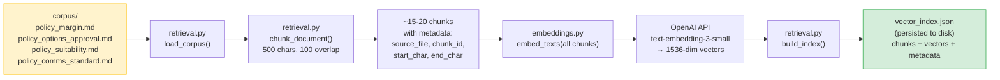
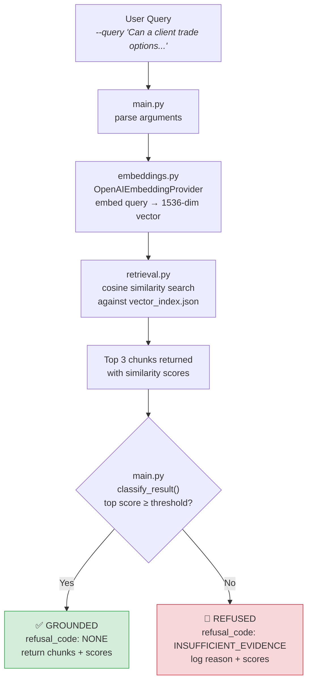
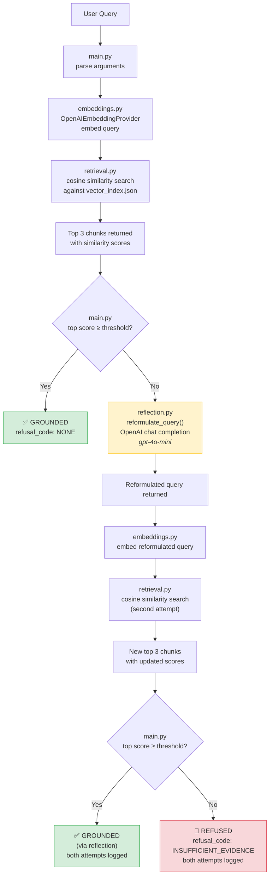
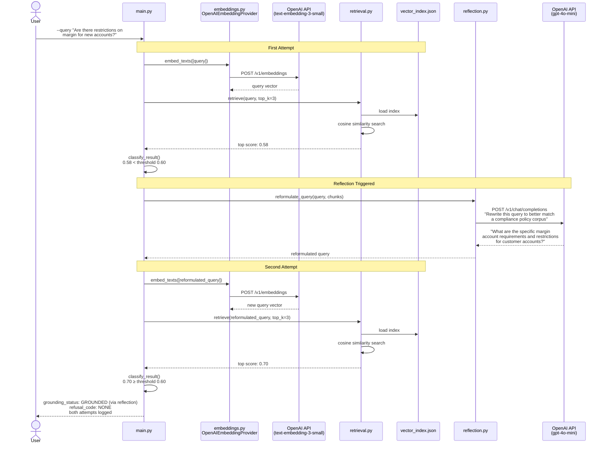

# RAG Knowledge Pilot — Measured Retrieval System

A feature-level Retrieval-Augmented Generation (RAG) pilot designed to demonstrate measurable retrieval behavior, structured refusal logic, and evaluation-driven iteration.

This module is intentionally executable, minimal, and instrumented — built to simulate how an internal AI knowledge feature would be piloted and evaluated inside a business team.

---

## Performance Summary

| Metric | Threshold 0.45 | Threshold 0.60 (no reflection) | Threshold 0.60 (with reflection) |
|---|---:|---:|---:|
| Grounded Answer Rate (GAR) | **100.0%** (11/11) | 72.7% (8/11) | **90.9%** (10/11) |
| Refusal Correctness Rate (RCR) | **100.0%** (4/4) | **100.0%** (4/4) | **100.0%** (4/4) |
| Avg Top-Chunk Similarity | 0.5854 | 0.5854 | 0.5911 |
| Reflection triggered | — | — | 7/15 queries |

**Evaluation dataset:** 15 domain-realistic compliance queries
**Query mix:** 11 should-ground · 4 should-refuse

**Threshold tradeoff:** Raising the grounding threshold from 0.45 to 0.60 increases conservatism — three borderline queries (scores 0.49, 0.58, 0.59) flip to refusal, dropping GAR to 72.7%.

**Reflection recovery:** With the agentic reflection loop enabled, the system reformulates borderline queries and retries retrieval once. This recovers 2 of 3 borderline queries, raising GAR from 72.7% to 90.9% — with no loss in refusal correctness. The remaining miss (score 0.49) is appropriately refused even after reformulation.

### Reproduce These Results

```bash
# Threshold 0.45 (default)
python modules/rag-knowledge-pilot/src/main.py --evaluate --reindex

# Threshold 0.60, with reflection (default)
GROUNDING_THRESHOLD=0.60 python modules/rag-knowledge-pilot/src/main.py --evaluate --reindex

# Threshold 0.60, without reflection
GROUNDING_THRESHOLD=0.60 python modules/rag-knowledge-pilot/src/main.py --evaluate --reindex --no-reflection
```

PowerShell:
```powershell
$env:GROUNDING_THRESHOLD="0.60"
# With reflection (default)
python modules/rag-knowledge-pilot/src/main.py --evaluate --reindex
# Without reflection
python modules/rag-knowledge-pilot/src/main.py --evaluate --reindex --no-reflection
```

---

## Quick Start

Run a sample query from the repository root:

```bash
python modules/rag-knowledge-pilot/src/main.py --query "Can a client trade options without a signed options agreement?"
```

**Example output:**

```
query: "Can a client trade options without a signed options agreement?"

retrieved_chunks:
  - rank=1  score=0.78  source=policy_options_approval.md
  - rank=2  score=0.64  source=policy_margin.md
  - rank=3  score=0.59  source=policy_suitability.md

grounding_status: GROUNDED
refusal_code: NONE
```

The system prints ranked retrieved chunks with similarity scores, a categorical grounding decision, and a structured refusal code when applicable.

---

## What This Pilot Demonstrates

- **Retrieval architecture** with swappable embedding provider abstraction (hosted vs. local models)
- **Agentic reflection loop** — automatic query reformulation and single-retry retrieval for borderline results
- **Measured grounding performance** using Grounded Answer Rate (GAR) and Refusal Correctness Rate (RCR)
- **Configurable grounding threshold** to explore precision/recall tradeoffs
- **Structured refusal behavior** with explicit reason codes and logged decisions
- **Traceable retrieval outputs** — every query produces inspectable chunk rankings, scores, and decisions

---

## Architecture Overview

```
rag-knowledge-pilot/
  src/
    main.py          # Entry point and CLI
    embeddings.py    # Embedding provider abstraction layer
    retrieval.py     # Chunking and retrieval logic
    reflection.py    # Agentic query reformulation (single-retry)
    evaluation.py    # Evaluation harness and scoring
  corpus/            # Synthetic internal compliance policy excerpts
  evaluation/        # Test queries and expected outcomes
  results/           # Scored evaluation run outputs
```

The structure is designed so retrieval strategy can evolve — lexical baseline → vector embeddings → provider swap → controlled retry logic — without changing module shape.

### How Corpus Documents Become Searchable



---

## Evaluation Design

The evaluation harness simulates realistic business partner usage.

Each of the 15 test queries includes:

- Query text
- Expected action (`ground` or `refuse`)
- For refusals: a structured reason code and rationale

The harness computes:

- **Grounded Answer Rate (GAR)** — % of groundable queries that return a grounded, cited response
- **Refusal Correctness Rate (RCR)** — % of refusal-worthy queries that correctly refuse with the right reason code
- **Retrieval characteristics** — similarity score distribution, top-1 vs. top-k reliance

This enables before/after comparisons when embedding models or thresholds change.

---

## Threshold Experimentation

Grounding decisions are threshold-driven. Running evaluation at multiple threshold values surfaces:

- Precision vs. recall tradeoffs in grounding decisions
- Retrieval sensitivity to similarity cutoffs
- Refusal rate changes under tighter constraints

At **0.45**, the system grounds all 11 groundable queries — including borderline cases with similarity scores as low as 0.49. At **0.60**, three borderline queries (scores 0.49, 0.58, 0.59) flip to refusal, reducing GAR to 72.7% while refusal correctness remains at 100%.

This models how real AI features are tuned during pilot phases before broader rollout.

---

## Agentic Reflection Loop

When the top retrieval score falls below the grounding threshold, the system can automatically reformulate the query and retry retrieval once before falling back to refusal. This is the "agentic" pattern — the system attempts to improve its own retrieval quality without human intervention.

### Without Reflection



### With Reflection



With reflection enabled, the system recovers 2 of 3 borderline queries at threshold 0.60, raising GAR from 72.7% to 90.9% while maintaining 100% refusal correctness.

### Detailed View: Borderline Query With Reflection



**Controls:**
- Enabled by default. Disable with `--no-reflection` or `REFLECTION_ENABLED=false`
- Maximum one retry — no recursive loops
- Reformulation uses OpenAI chat completion (gpt-4o-mini), not embeddings
- Evaluation harness tracks how many queries triggered reflection

---

## Setup

Requires an OpenAI API key for embeddings:

```powershell
# PowerShell (session)
$env:OPENAI_API_KEY="sk-..."

# Bash
export OPENAI_API_KEY=sk-...
```

If the key is missing, the system exits gracefully with setup instructions (no stack trace).

---

## Limitations

This module is a pilot and evaluation harness. It is not production software and makes no claims about scale, latency, security, or enterprise hardening.

Its purpose is to demonstrate measurable retrieval behavior and support controlled, evaluation-driven iteration of AI feature design.

---

## Relationship to Module 4

This pilot operationalizes the governance architecture defined in [Module 4 — Compliance Retrieval Assistant](../compliance-retrieval-assistant/).

Module 4 defines the control-plane thinking and refusal taxonomy.
Module 5 executes retrieval behavior and measures it.

Together they illustrate progression:

**Architecture → Executable Pilot → Measured Iteration**