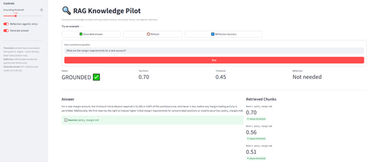
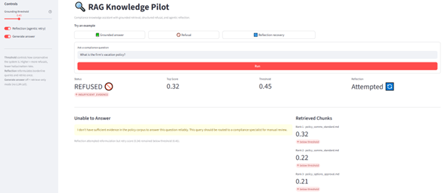
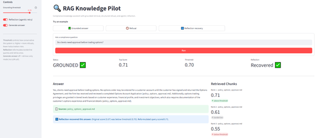
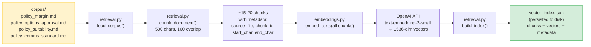
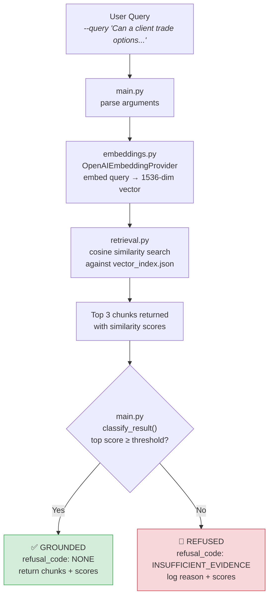
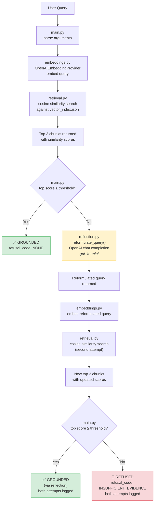

# RAG Knowledge Pilot — Measured Retrieval System

An executable RAG pilot that demonstrates how a regulated AI knowledge feature can measure retrieval confidence, enforce structured refusal, and recover borderline queries using a controlled reflection loop.

This module is intentionally executable, minimal, and instrumented — built to simulate how an internal AI knowledge feature would be piloted and evaluated inside a business team.

---

## Performance Summary

| Metric | Threshold 0.45 | Threshold 0.60 (no reflection) | Threshold 0.60 (with reflection) |
|---|---:|---:|---:|
| Grounded Answer Rate (GAR) | **100.0%** (11/11) | 72.7% (8/11) | **90.9%** (10/11) |
| Refusal Correctness Rate (RCR) | **100.0%** (4/4) | **100.0%** (4/4) | **100.0%** (4/4) |
| Avg Top-Chunk Similarity | 0.5854 | 0.5854 | 0.5911 |
| Reflection triggered | — | — | 7/15 queries |

**Evaluation dataset:** 15 domain-realistic compliance queries
**Query mix:** 11 should-ground · 4 should-refuse

**Threshold tradeoff:** Raising the grounding threshold from 0.45 to 0.60 increases conservatism — three borderline queries (scores 0.49, 0.58, 0.59) flip to refusal, dropping GAR to 72.7%.

**Reflection recovery:** With the agentic reflection loop enabled, the system reformulates borderline queries and retries retrieval once. This recovers 2 of 3 borderline queries, raising GAR from 72.7% to 90.9% — with no loss in refusal correctness. The remaining miss (score 0.49) is appropriately refused even after reformulation.

### Reproduce These Results

```bash
# Threshold 0.45 (default)
python modules/rag-knowledge-pilot/src/main.py --evaluate --reindex

# Threshold 0.60, with reflection (default)
GROUNDING_THRESHOLD=0.60 python modules/rag-knowledge-pilot/src/main.py --evaluate --reindex

# Threshold 0.60, without reflection
GROUNDING_THRESHOLD=0.60 python modules/rag-knowledge-pilot/src/main.py --evaluate --reindex --no-reflection
```

PowerShell:
```powershell
$env:GROUNDING_THRESHOLD="0.60"
# With reflection (default)
python modules/rag-knowledge-pilot/src/main.py --evaluate --reindex
# Without reflection
python modules/rag-knowledge-pilot/src/main.py --evaluate --reindex --no-reflection
```

---

## Try It — Three Queries, Three Behaviors

These three commands demonstrate the system's core decision-making: grounded citation, structured refusal, and agentic recovery.

### 1. Grounded Answer — retrieves, cites, responds

```bash
python modules/rag-knowledge-pilot/src/main.py --query "What are the margin requirements for a new account?"
```

```
query: "What are the margin requirements for a new account?"

retrieved_chunks:
  - rank=1  score=0.70  source=policy_margin.md
  - rank=2  score=0.56  source=policy_margin.md
  - rank=3  score=0.51  source=policy_margin.md

grounding_status: GROUNDED
refusal_code: NONE

answer:
  For a new margin account, the minimum initial deposit required is $2,000
  or 100% of the purchase price, whichever is less, before any margin trading
  activity is permitted. Additionally, the firm reserves the right to impose
  higher initial margin requirements for concentrated positions or volatile
  securities [policy_margin.md].

sources_cited: ['policy_margin.md']
tokens: prompt=495  completion=61  total=556
model: gpt-4o-mini
```

High retrieval confidence → the system generates a cited answer from corpus evidence only.

### 2. Structured Refusal — out-of-scope query, zero cost

```bash
python modules/rag-knowledge-pilot/src/main.py --query "What is the firm's vacation policy?"
```

```
query: "What is the firm's vacation policy?"

retrieved_chunks:
  - rank=1  score=0.32  source=policy_comms_standard.md
  - rank=2  score=0.22  source=policy_comms_standard.md
  - rank=3  score=0.21  source=policy_options_approval.md

grounding_status: REFUSED
refusal_code: INSUFFICIENT_EVIDENCE

refusal:
  I don't have sufficient evidence in the policy corpus to answer this
  question reliably. This query should be routed to a compliance specialist
  for manual review.

tokens: prompt=0  completion=0  total=0
model: none (refusal — no LLM call)
```

Low retrieval scores → the system refuses rather than hallucinate. No LLM call, no cost, no risk. Reflection attempted a reformulation but retrieval remained below threshold — refusal upheld.

### 3. Reflection Recovery — borderline query, agentic retry succeeds

```powershell
$env:GROUNDING_THRESHOLD="0.70"
python modules/rag-knowledge-pilot/src/main.py --query "Do clients need approval before trading options?"
```

```bash
GROUNDING_THRESHOLD=0.70 python modules/rag-knowledge-pilot/src/main.py --query "Do clients need approval before trading options?"
```

```
query: "Do clients need approval before trading options?"

retrieved_chunks:
  - rank=1  score=0.71  source=policy_options_approval.md
  - rank=2  score=0.61  source=policy_options_approval.md
  - rank=3  score=0.56  source=policy_options_approval.md

grounding_status: GROUNDED
refusal_code: NONE

answer:
  Yes, clients need approval before trading options. No options order may
  be entered for a customer account until the customer has signed and
  returned the Options Agreement, and the firm has received and reviewed
  a completed Options Account Application [policy_options_approval.md].
  Additionally, options trading privileges are granted in tiered levels
  based on customer experience, financial profile, and investment
  objectives [policy_options_approval.md].

sources_cited: ['policy_options_approval.md']
tokens: prompt=508  completion=91  total=599
model: gpt-4o-mini

[Reflection] Triggered — reformulated query: "What are the approval
  requirements for clients before they can trade options?"
[Reflection] Retry top score: 0.71
[Reflection] Final decision: GROUNDED
```

At threshold 0.70, the original query falls just below the grounding bar — triggering the reflection loop. The system reformulates the query and retries; the displayed chunks and scores reflect the successful retry attempt. The `[Reflection]` log at the bottom confirms the reformulated query and its score.

This models real enterprise behavior: rather than failing on borderline input, the system makes one controlled attempt to improve retrieval before falling back to refusal.

---

**What these three examples show together:**

| Behavior | Query | Outcome | LLM cost |
|---|---|---|---|
| Grounded answer | In-domain, clear match | Cited response from corpus | Normal |
| Structured refusal | Out-of-domain | Refusal + routing recommendation | Zero |
| Agentic recovery | In-domain, borderline | Reformulate → retry → grounded answer | Reflection + generation |

The system treats **refusal as a first-class output, not an error** — and uses **measured retrieval confidence** to decide when to answer, when to retry, and when to say no.

### Audit Trail: Verify Any Answer

Add `--show-evidence` to any query to display the actual corpus text used to generate the answer:

```bash
python modules/rag-knowledge-pilot/src/main.py --query "What are the margin requirements for a new account?" --show-evidence
```

This prints the retrieved chunk text alongside the answer — so reviewers can verify that every cited claim traces back to source evidence. Also works with `--json` for structured output.

---

## Live Demo Walkthrough

The Streamlit UI makes the system's decision-making visible in real time. Launch it with:

```bash
streamlit run modules/rag-knowledge-pilot/src/app.py
```

Three example buttons demonstrate the core behaviors in one click each:

**Grounded answer** — the system retrieves relevant policy chunks, confirms the top score exceeds the grounding threshold, and generates a cited response. No hallucination, no uncited claims.



**Structured refusal** — an out-of-scope query retrieves low-scoring chunks. The system refuses rather than fabricate an answer, routes to a compliance specialist, and makes zero LLM calls. Refusal costs nothing.



**Reflection recovery** — at a higher threshold (0.70), the original query scores just below the bar. The system automatically reformulates and retries, recovering a grounded answer on the second attempt. The blue info bar shows both scores.



The sidebar controls let you adjust the grounding threshold, toggle reflection, and switch between full generation and retrieve-only mode — making the precision/recall tradeoff interactive.

---

## What This Pilot Demonstrates

This module simulates how an internal compliance knowledge assistant would be piloted, evaluated, tuned, and governed before broader rollout.

- **Grounded answer generation** — cited responses synthesized only from retrieved evidence, with structured refusal when evidence is insufficient
- **Retrieval architecture** with swappable embedding provider abstraction (hosted vs. local models)
- **Agentic reflection loop** — automatic query reformulation and single-retry retrieval for borderline results
- **Measured grounding performance** using Grounded Answer Rate (GAR) and Refusal Correctness Rate (RCR)
- **Configurable grounding threshold** to explore precision/recall tradeoffs
- **Structured refusal behavior** with explicit reason codes and logged decisions
- **Traceable retrieval outputs** — every query produces inspectable chunk rankings, scores, and decisions

---

## Architecture Overview

```
rag-knowledge-pilot/
  src/
    main.py          # Entry point and CLI
    embeddings.py    # Embedding provider abstraction layer
    retrieval.py     # Chunking and retrieval logic
    reflection.py    # Agentic query reformulation (single-retry)
    generation.py    # Grounded answer synthesis with citations
    app.py           # Streamlit UI for interactive demo
    evaluation.py    # Evaluation harness and scoring
  corpus/            # Synthetic internal compliance policy excerpts
  evaluation/        # Test queries and expected outcomes
  results/           # Scored evaluation run outputs
  docs/screenshots/  # UI screenshots for documentation
```

The structure is designed so retrieval strategy can evolve — lexical baseline → vector embeddings → provider swap → controlled retry logic — without changing module shape.

### How Corpus Documents Become Searchable



---

## Evaluation Design

The evaluation harness simulates realistic business partner usage.

Each of the 15 test queries includes:

- Query text
- Expected action (`ground` or `refuse`)
- For refusals: a structured reason code and rationale

The harness computes:

- **Grounded Answer Rate (GAR)** — % of groundable queries that return a grounded, cited response
- **Refusal Correctness Rate (RCR)** — % of refusal-worthy queries that correctly refuse with the right reason code
- **Retrieval characteristics** — similarity score distribution, top-1 vs. top-k reliance

This enables before/after comparisons when embedding models or thresholds change.

---

## Threshold Experimentation

Grounding decisions are threshold-driven. Running evaluation at multiple threshold values surfaces:

- Precision vs. recall tradeoffs in grounding decisions
- Retrieval sensitivity to similarity cutoffs
- Refusal rate changes under tighter constraints

At **0.45**, the system grounds all 11 groundable queries — including borderline cases with similarity scores as low as 0.49. At **0.60**, three borderline queries (scores 0.49, 0.58, 0.59) flip to refusal, reducing GAR to 72.7% while refusal correctness remains at 100%.

This models how real AI features are tuned during pilot phases before broader rollout.

---

## Agentic Reflection Loop

When the top retrieval score falls below the grounding threshold, the system can automatically reformulate the query and retry retrieval once before falling back to refusal. This is the "agentic" pattern — the system attempts to improve its own retrieval quality without human intervention.

### Without Reflection



### With Reflection



With reflection enabled, the system recovers 2 of 3 borderline queries at threshold 0.60, raising GAR from 72.7% to 90.9% while maintaining 100% refusal correctness.

### Detailed View: Borderline Query With Reflection


**Controls:**
- Enabled by default. Disable with `--no-reflection` or `REFLECTION_ENABLED=false`
- Maximum one retry — no recursive loops
- Reformulation uses OpenAI chat completion (gpt-4o-mini), not embeddings
- Evaluation harness tracks how many queries triggered reflection

---

## Setup

Requires an OpenAI API key for embeddings and generation:

```powershell
# PowerShell (session)
$env:OPENAI_API_KEY="sk-..."

# Bash
export OPENAI_API_KEY=sk-...
```

For the Streamlit UI, also install:

```bash
pip install streamlit
```

If the key is missing, both the CLI and UI exit gracefully with setup instructions (no stack trace).

---

## Why This Matters

In regulated domains, AI systems must know when to answer, when to retry, and when to refuse. This pilot makes those decisions measurable and auditable:

- Hallucination risk is governed through measurable retrieval thresholds, not trust in model behavior
- Refusal is treated as a first-class output — with reason codes, routing recommendations, and zero cost
- Threshold tuning and reflection impact can be evaluated quantitatively before broader rollout
- Every decision is traceable: query → retrieval scores → grounding classification → answer or refusal

---

## Limitations

This module is a pilot and evaluation harness. It is not production software and makes no claims about scale, latency, security, or enterprise hardening.

Its purpose is to demonstrate measurable retrieval behavior and support controlled, evaluation-driven iteration of AI feature design.

---

## Relationship to Module 4

This pilot operationalizes the governance architecture defined in [Module 4 — Compliance Retrieval Assistant](../compliance-retrieval-assistant/).

Module 4 defines the control-plane thinking and refusal taxonomy.
Module 5 executes retrieval behavior and measures it.

Together they illustrate progression:

**Architecture → Executable Pilot → Measured Iteration**