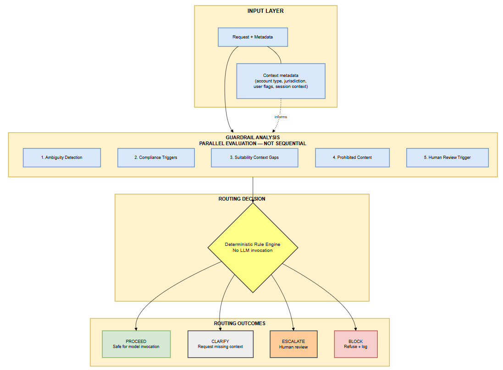
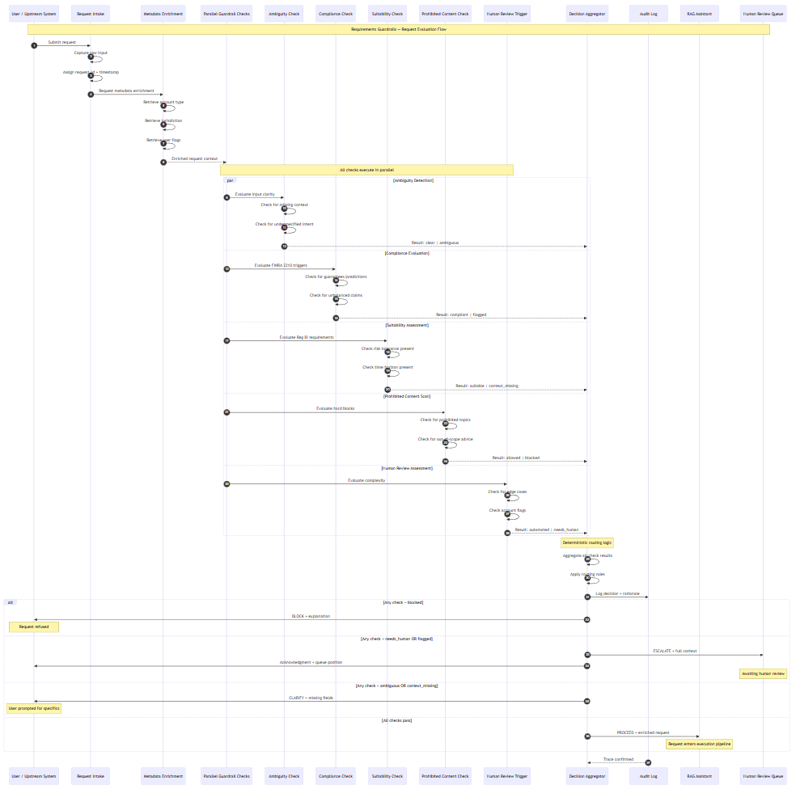

# Requirements Guardrails

**Pre-Invocation Risk & Ambiguity Detection for Regulated AI Workflows**

**Status:** 🟡 In Progress  
**Module:** 3 of 4 in the Regulated AI Workflow Toolkit

---

## Purpose

This module acts as a **pre-invocation control layer** that evaluates whether an AI request can safely proceed in a regulated environment. It identifies ambiguity, risk factors, and compliance triggers *before* any model is invoked—ensuring that problematic inputs are caught, clarified, or escalated rather than processed blindly.

> **Core insight:** Guardrails are product decisions, not model features.

---

## The Problem This Solves

Most AI failures in regulated industries don't stem from weak models—they stem from what happens *before* the model runs:

- **LLMs accept almost anything.** They'll generate responses to ambiguous, risky, or prohibited requests without hesitation.
- **Regulated systems cannot.** Financial services, healthcare, and insurance operate under strict communication and suitability standards.
- **Most failures originate before model invocation.** Garbage in, compliance violation out.

Without guardrails at the input layer, organizations either:
1. Deploy AI that produces risky outputs, or
2. Refuse to deploy AI at all

This module provides a **third path**: structured input analysis that enables safe AI deployment.

> **PM DECISION:** In regulated environments, the cost of a bad model output far exceeds the cost of asking for clarification. This module treats input quality as a first-class product concern.

---

## Where It Sits in the Workflow

```
Market Intelligence    →    ROI Engine    →    [Guardrails]    →    RAG Assistant
 (surfaces opportunities)   (prioritizes)      (enforces safety)   (delivers outputs)
```

**Upstream:** ROI Decision Engine determines *which* AI workflows to build  
**This module:** Determines *whether* a specific request can safely proceed  
**Downstream:** Compliant requests proceed to RAG Assistant for execution

Inputs arrive from users, workflows, or upstream systems. Outputs are routing decisions:
- **Proceed** — Safe for model invocation
- **Clarify** — Request additional context
- **Escalate** — Route to human review
- **Block** — Refuse with explanation

> **PM DECISION:** Guardrails operate at request-time, not deployment-time. Every input is evaluated—this is runtime governance, not a one-time checklist.

---

## Architecture Overview

### Context Diagram (System-in-the-World)



The context diagram shows how user requests and upstream metadata flow into the guardrails layer, how parallel checks evaluate risk across multiple dimensions, and how routing decisions feed downstream execution or human review queues.

**Key design choices reflected:**
- Guardrails execute in **parallel**, not sequentially
- Metadata (account type, jurisdiction, flags) informs suitability and compliance checks
- "Human Review Trigger" (check) is distinct from "ESCALATE" (outcome)
- Routing decision is **deterministic** — no general-purpose LLM invocation

---

### Sequence Diagram (Request Evaluation Flow)



*End-to-end flow showing how incoming requests are evaluated, classified, and routed.*

**High-level steps:**

1. **Request Intake** — Capture raw input, assign request_id and timestamp
2. **Metadata Enrichment** — Retrieve account type, jurisdiction, and user flags
3. **Parallel Guardrail Checks** — All five categories evaluate simultaneously
4. **Decision Aggregation** — Deterministic routing logic applies priority rules
5. **Routing Decision** — BLOCK → ESCALATE → CLARIFY → PROCEED (priority order)
6. **Audit Logging** — Trace confirmed before any response returned

> **Key pattern:**  
> Checks run in parallel, but routing follows strict priority: a BLOCK overrides everything, ESCALATE overrides CLARIFY, and PROCEED only happens when all checks pass.

For detailed architecture decisions, see [Architecture Decision Records](./architecture/).

---

## Guardrail Categories

This is where product judgment meets regulatory reality. Each category represents a class of risk that must be detected before model invocation.

### 1. Ambiguity

**Why it matters:** Models interpret ambiguous inputs unpredictably. In regulated environments, unpredictable outputs create liability.

**What triggers it:**
- Missing context (e.g., "What should I invest in?" with no risk profile)
- Underspecified intent (e.g., "Tell me about retirement" — advice? education? products?)
- Pronouns without referents (e.g., "Is that a good idea?" — what idea?)

**What happens:** Request routed to CLARIFY; user prompted for specifics.

---

### 2. Compliance Triggers

**Why it matters:** Regulated communications must meet specific standards. Violations expose the firm to regulatory action.

**What triggers it:**
- Investment recommendations without suitability context
- Guarantees or predictions ("This stock will double")
- Unbalanced claims (benefits without risks)
- Communications that could mislead retail investors

**Regulatory anchor:** FINRA Rule 2210 — fair, balanced, not misleading.

**What happens:** Request routed to ESCALATE for compliance review, or BLOCK if clearly prohibited.

---

### 3. Suitability & User Context Gaps

**Why it matters:** Recommendations must be appropriate for the specific customer. Generic advice in a personalized context is a suitability failure.

**What triggers it:**
- Recommendation requests without risk tolerance
- Product suggestions without account type context
- Time horizon not established
- Jurisdiction unknown (different rules apply)

**Regulatory anchor:** SEC Regulation Best Interest (Reg BI).

**What happens:** Request routed to CLARIFY with specific context requirements.

---

### 4. Prohibited or High-Risk Content

**Why it matters:** Some requests should never reach a model, regardless of context.

**What triggers it:**
- Requests for specific security recommendations
- Tax or legal advice beyond permitted scope
- Content involving minors or vulnerable populations
- Attempts to extract proprietary information

**What happens:** Request routed to BLOCK; logged for audit; user receives explanation.

---

### 5. Human Review Trigger

**Why it matters:** Some requests are legitimate but exceed automated handling capacity. Human judgment is the appropriate response.

**What triggers it:**
- Complex multi-part requests spanning compliance domains
- Edge cases not covered by existing rules
- Requests from flagged accounts or high-risk customer segments
- Novel scenarios requiring precedent decisions

**What happens:** Request routed to ESCALATE; queued for human review with full context.

---

## Output Contracts

This module returns a structured decision, not a model response. The output contract ensures downstream systems (and audit logs) receive consistent, actionable information.

```json
{
  "request_id": "uuid",
  "timestamp": "ISO-8601",
  "classification": "PROCEED | CLARIFY | ESCALATE | BLOCK",
  "category": "ambiguity | compliance | suitability | prohibited | escalation",
  "confidence": "high | medium | low",
  "explanation": "Human-readable rationale for the decision",
  "next_action": "Description of what happens next",
  "missing_context": ["list", "of", "required", "fields"],
  "escalation_reason": "Why human review is required",
  "block_reason": "Why request was refused"
}
```

> **PM DECISION:** Thinking in interfaces, not scripts. This contract defines what the module *promises*, independent of how it's implemented.

---

## Design Principles

These principles reflect a governance-first philosophy aligned with the portfolio's core thesis.

| Principle | Rationale |
|-----------|-----------|
| **Fail early** | Catch problems before model invocation, not after |
| **Be explainable** | Every decision must have auditable rationale |
| **Prefer false positives over silent risk** | Better to ask for clarification than process bad input |
| **Human-in-the-loop is a feature** | Escalation is a valid outcome, not a system failure |
| **No opaque inference at control layer** | Rules and narrow validated classifiers only; no general-purpose LLM |
| **Runtime governance** | Every request evaluated, not just at deployment |

These guardrail principles are derived from shared regulatory expectations documented in the central [Regulatory Context](../../regulatory-governance/), which this module references to drive consistent, explainable routing decisions without embedding jurisdiction-specific rules.


> **PM DECISION:** These aren't aspirational values—they're constraints that shape every design choice in this module.

---

## Regulatory Alignment

This module explicitly addresses requirements from key regulatory frameworks:

| Regulation | How It's Addressed |
|------------|-------------------|
| **FINRA 2210** | Communication standards checks (fair, balanced, not misleading) |
| **Reg BI** | Suitability flags when recommendation context is missing |
| **SR 11-7** | Auditable decision logic; documented classification rationale |
| **17a-4** | All routing decisions logged with timestamps and reasoning |

*These references are used as conceptual anchors for product design, not legal interpretations.*

---

## What This Module Does NOT Do

Scope discipline is a senior PM signal. This module has clear boundaries:

- ❌ **Does not generate responses** — That's Module 4 (RAG Assistant)
- ❌ **Does not prioritize opportunities** — That's Module 2 (ROI Engine)
- ❌ **Does not attempt semantic "truth"** — It classifies risk, not factual accuracy
- ❌ **Does not replace compliance review** — Escalation routes to humans
- ❌ **Does not guarantee model safety** — It reduces input risk; output risk is a separate concern
- ❌ **Does not use general-purpose ML for routing** — Rules and narrow validated classifiers ensure explainability

> **PM DECISION:** Knowing what NOT to build is as important as knowing what to build. Every exclusion here is a deliberate choice.

---

## Repository Map

| Artifact / Path | Purpose |
|-----------------|---------|
| 🟦 **architecture/** | Design decisions and ADRs |
| `architecture/ADR-001-routing-logic.md` | Why deterministic routing |
| `architecture/ADR-002-escalation-design.md` | Escalation vs. refusal design |
| 🟦 **docs/** | Specifications and architecture visualizations |
| `docs/diagrams/` | Visual architecture artifacts |
| `docs/diagrams/requirements_guardrails_Context_Diagram.PNG` | System-in-the-world view |
| `docs/diagrams/requirements_guardrails_Sequence_Diagram.PNG` | Request evaluation flow *(planned)* |
| 🟦 **rules/** | Classification criteria and triggers |
| `rules/ambiguity-heuristics.md` | Ambiguity detection patterns |
| `rules/compliance-triggers.md` | FINRA 2210 patterns |
| `rules/prohibited-content.md` | Hard block definitions |
| 🟦 **evidence/** | Sample classifications and edge cases |
| `evidence/sample-classifications/` | Input → Classification examples |
| `evidence/edge-cases/` | Documented boundary decisions |
| 🟦 **outputs/** | Sample audit artifacts |
| `outputs/routing-decision-log.md` | Sample audit trail |
| 🟦 **experiments/** | Guardrail prompt testing |
| `experiments/prompt-exp-06-*.md` | Guardrail prompt experiments |

---

## Success Criteria

This module is complete when:

- [x] Guardrail categories documented with triggers and outcomes
- [x] Output contract defined and validated
- [x] FINRA 2210 compliance triggers codified with examples
- [ ] At least 10 sample inputs with classifications
- [ ] Edge cases documented with PM rationale
- [ ] ADR explaining deterministic routing decision
- [ ] Integration contract with RAG Assistant defined
- [ ] Design principles reflected in all artifacts
- [ ] Sequence diagram showing request evaluation flow

---

## Key PM Decisions Documented

| Decision | Rationale |
|----------|-----------|
| **No opaque inference at control layer** | Auditability requires explainable routing; general-purpose LLMs rejected |
| **Narrow classifiers acceptable** | For subjective checks (implied guarantees, tone), validated single-task classifiers preserve auditability |
| **Escalate vs. refuse distinction** | Escalation preserves user intent; refusal blocks harmful patterns |
| **Clarify before processing** | Ambiguity is a product problem, not a model problem |
| **Explicit output contract** | Interface-first design enables modular architecture |

---

## Relationship to Other Modules

| Module | Relationship |
|--------|--------------|
| **Market Intelligence** (Module 1) | No direct dependency; operates on different timescales |
| **ROI Decision Engine** (Module 2) | Consumes workflow context; knows which use cases are approved |
| **Compliance RAG Assistant** (Module 4) | Feeds PROCEED requests downstream; defines handoff contract |
| **Audit Infrastructure** | Emits structured logs for all routing decisions |

---

## Closing Note

The Requirements Guardrails module is intentionally **conservative**.

Its value is not in enabling more AI — it's in enabling *safer* AI. By catching ambiguity, risk, and compliance triggers before model invocation, this module transforms guardrails from a compliance checkbox into a product capability.

In regulated environments, the question isn't "can the model handle this?" — it's "should we let it try?" This module ensures that question gets answered explicitly, every time.

---

*Part of the Regulated AI Workflow Toolkit — demonstrating governance-first AI product design for regulated industries.*