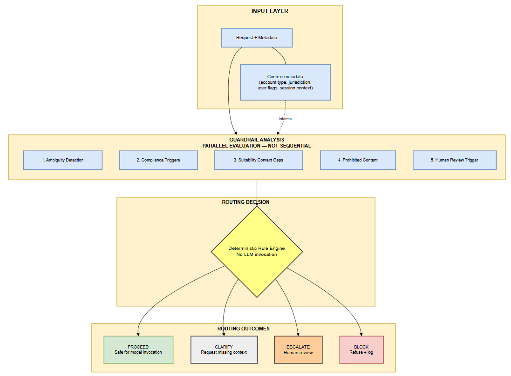
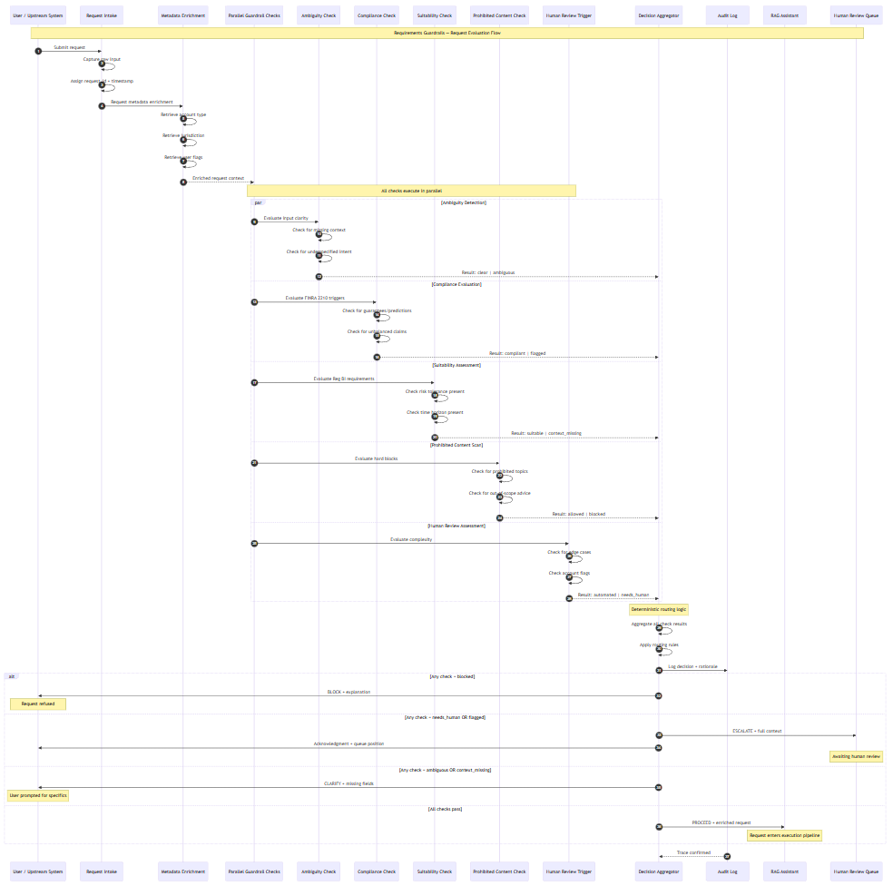

# Module 3 - Requirements Guardrails — Pre-Invocation Classifier with Interactive Mechanism Demo

> **10-Second Summary:**
> A working deterministic classifier that decides whether an AI request can
> safely proceed in a regulated environment — PROCEED, CLARIFY, ESCALATE, or
> BLOCK. The deployed Streamlit demo exposes two architectural mechanisms as
> a single-click toggle, so a reviewer can see how the classification
> changes when the governance logic is turned off.

Click the "Live Demo" ribbon above to run the demo.

*Compare Mode showing how the context-first override (ADR-003) changes the
outcome from ESCALATE to CLARIFY on the same query. The mechanism is the
architectural decision, not a model default.*

---

## What This Module Does

This module is a pre-invocation control layer for regulated AI workflows. Before any model is invoked, a user request passes through a deterministic classifier that evaluates the request against three guardrail categories — compliance triggers, suitability and context gaps, and prohibited content.

The classifier returns one of four routing decisions: **PROCEED** (safe to forward to the model), **CLARIFY** (request additional context from the user), **ESCALATE** (route to a human reviewer), or **BLOCK** (refuse with an explanation).

Two architectural mechanisms shape the routing in specific cases: a context-first override prevents premature escalation when the user's request lacks suitability context, and a produce-intent upgrade hardens the response when the user is asking the system to *generate* prohibited content rather than merely discuss it. The deployed demo exposes a Compare Mode that turns these mechanisms on and off so the architectural effect is directly observable.

The result is a structured routing decision with a complete audit trail — not a generated response, and not a model judgment.

---

## Why This Matters (Portfolio Context)

Module 3 was the architectural gap in the Regulated AI Workflow Toolkit. Modules 5 and 6 demonstrated retrieval and orchestration as working systems. Module 4 described compliance retrieval as an architectural specification. Module 3 sat between them as a design artifact only — the one place in the portfolio where pre-invocation control was discussed but not built.

This module closes that gap by shipping a working, tested classifier with an interactive demo. But the more interesting work is what the demo makes visible:

- A **deterministic routing architecture** that doesn't invoke an LLM at the decision boundary — explainable by design, not by post-hoc rationalization
- A **context-first override** that prevents one architectural decision (priority routing) from producing a worse user experience in a specific case (ADR-003)
- A **produce-intent upgrade** that distinguishes between a request that *contains* prohibited language and a request that asks the system to *generate* it (ADR-004)
- A **deliberate v1 scope** that ships three of five guardrail categories and documents the other two with duty-of-care reasoning rather than partial implementation (ADR-005)

Each of these is an architectural decision documented as an ADR. The Compare Mode toggle in the Streamlit UI makes the first two of them *interactive* — a reviewer can see, in one click, how the classification changes when the mechanism is disabled.

> This module spans both veins of the portfolio: it's a working classifier (builder) that operationalizes pre-invocation governance (governance). The two veins meet here because pre-invocation control is the place where governance becomes deterministic code.

---

## System Architecture

The classifier evaluates each request against three rule categories in parallel — compliance triggers, suitability and context gaps, and prohibited content. Rule matching is deterministic, driven by YAML configuration and a small set of Python heuristics. No general-purpose model is invoked at the decision boundary. The output is a structured `GuardrailResult` containing the routing decision, the rule that drove it, the full audit list of every rule that fired (including rules that were suppressed by the context-first override), and the mechanisms that affected the outcome.

### Context Diagram (System-in-the-World)

User requests and upstream metadata flow into the guardrails layer. Parallel checks evaluate risk across multiple dimensions. Routing decisions feed downstream execution or human review queues. The decision boundary is deterministic; no general-purpose LLM participates in the routing.

### Sequence Diagram (Request Evaluation Flow)

End-to-end flow from request intake through routing decision and audit logging. Checks run in parallel, but routing follows strict priority: BLOCK overrides ESCALATE, ESCALATE overrides CLARIFY, PROCEED only when all checks pass.

### Classifier Orchestration

The shipped classifier (`src/classifier.py`) implements the sequence diagram as a deterministic 10-step orchestration:

    1.  Evaluate all three rule categories     → produces candidate matches
    2.  Resolve heuristic rules                → keeps only confirmed matches
    3.  Compute effective classifications      → applies produce-intent upgrade (ADR-004)
    4.  Apply context-first override           → suppresses some rules from priority resolution (ADR-003)
    5.  Resolve priority                       → final classification + driver rule
    6.  Build full triggered-rules audit list  → including suppressed and upgraded rules
    7.  Identify which mechanisms fired        → for Compare Mode and UI rendering
    8.  Collect missing-context fields         → for CLARIFY decisions
    9.  Build human-readable decision metadata → reason + next action
    10. Construct and return GuardrailResult   → structured output

The orchestration is non-mutating: mechanisms compute effective values separately rather than overwriting the rules' original classifications. This preserves the full audit trail and is what makes Compare Mode possible — the classifier can be invoked with `apply_mechanisms=False` to produce the literal priority-routing outcome without modifying any rule state.

The architectural property that matters most: at no point in this sequence does a general-purpose model decide what the classification should be. Every decision is reducible to a rule firing or a documented mechanism. A reviewer or auditor can trace any classification back to source.

---

## The Decision Space

The classifier returns one of four routing decisions. Each is an architectural commitment about how the system handles a class of input — not a verdict on whether the input is "good" or "bad," but a routing instruction for what should happen next.

### PROCEED

Safe to forward to the model. No guardrails triggered, or the rules that fired did not rise to a routing-worthy level. The decision metadata still travels with the request, so a downstream system can record that the input was evaluated.

### CLARIFY

The request is well-formed but lacks context required to evaluate it responsibly. The classifier returns the specific fields that need to be supplied — risk tolerance, time horizon, jurisdiction, account type — and the next-action text instructs the caller to ask the user before re-evaluating. CLARIFY is treated as a first-class output, not an error path. A request that triggers CLARIFY has not failed; it is incomplete.

### ESCALATE

The request raises a compliance, suitability, or contextual concern that exceeds automated handling. Routing goes to a human reviewer, with the full audit trail attached. ESCALATE is the response for cases where the model could technically produce an answer but the answer would benefit from human judgment about whether to send it.

### BLOCK

The request is outside permitted scope, regardless of phrasing or context. The classifier refuses with an explanation. BLOCK is reserved for cases where no amount of clarification or human review would make the request safe to fulfill — most notably, requests that ask the system to *generate* prohibited content rather than discuss it.

### Priority and tiebreaking

When multiple rules fire on a single request, priority routing resolves the outcome: **BLOCK > ESCALATE > CLARIFY > PROCEED**. If two rules fire at the same priority level, category tiebreaking applies: **prohibited > compliance > suitability**.

Two mechanisms can modify this literal priority routing in specific cases — the context-first override (ADR-003) and the produce-intent upgrade (ADR-004). Both are documented in the Architectural Decisions section below.

### Output structure

Each decision returns a `GuardrailResult` dataclass containing the classification, the driver rule, decision and next-action text, the full audit list of triggered rules (with suppression and upgrade markers preserved), missing-context fields when applicable, and the list of mechanisms that affected the outcome. The full schema is in `src/models.py`.

---

## Guardrail Categories

The v1 classifier implements three of the five guardrail categories specified in the original module design. The other two are deferred — not because they were out of time, but because each carries a prerequisite that exceeds what a portfolio demo classifier should responsibly ship without. The deferral reasoning is documented in [ADR-005](./architecture/ADR-005-v1-scope-deferred-categories.md).

### Implemented in v1

**Compliance Triggers** — Patterns that violate or risk violating regulated communication standards. Includes guarantee language, predictions presented as fact, unbalanced claims (benefits without risk disclosure), advice boundaries (investment, tax, legal), and market manipulation. Regulatory anchors: FINRA Rule 2210 (fair, balanced, not misleading communications) and SEC Regulation Best Interest.

**Suitability & Context Gaps** — Recommendation requests that lack the user context required to evaluate them responsibly. Triggers when the user asks for guidance but has not provided risk tolerance, time horizon, jurisdiction (for tax questions), or account type (for product questions). Regulatory anchor: Reg BI's care obligation — recommendations must be based on the customer's profile.

**Prohibited Content (three of five sub-categories)** — Hard refusals for requests that no amount of context would make safe to fulfill. v1 covers illegal activity, system exploitation (prompt injection, jailbreaking), and out-of-scope queries (handled as soft redirects to the financial-services domain).

### Deferred in v1

**Ambiguity Detection** and **Human Review Triggers** — both deferred on engineering grounds. Both require capabilities that exceed deterministic rules: ambiguity detection needs to resolve missing referents and underspecified intent without conversation history; human-review triggers need multi-domain reasoning across compliance, suitability, and account state simultaneously. These are appropriate targets for narrow validated classifier components in v2 — the rules-only commitment in ADR-001 explicitly defers them rather than shipping shallow rule-based versions that would produce poor detection quality.

**Prohibited Content sub-categories 2 (harm to self or others) and 5 (abusive content)** — deferred on duty-of-care grounds, not engineering grounds. Detection is the easy part. Responsible handling is the work that exceeds portfolio scope. Crisis detection without validated crisis-response infrastructure and escalation paths to human-staffed support would create the appearance of responsible handling without the substance. Abuse moderation without a written policy, escalation thresholds, and appeal mechanisms would do the same. The detection patterns are documented in `rules/prohibited-content.md` for design reference; implementation is deferred until the supporting commitments exist.

The distinction between the two deferral paths matters. *"We didn't have time to build this"* and *"we should not build this without the supporting commitments"* are different statements. ADR-005 keeps them separate because they describe different kinds of unfinished work — one is a scope limit, the other is a product judgment about what shipping incomplete crisis handling would actually do to users.

---

## Architectural Decisions

The classifier's behavior is shaped by five documented architectural decisions. Each ADR captures a specific design commitment, the alternatives considered, and the consequences accepted. The ADRs are linked from the demo's mechanism panels — a reviewer who clicks through Compare Mode lands directly on the relevant decision.

| ADR | Decision | Why it matters |
|-----|----------|----------------|
| [ADR-001](./architecture/ADR-001-routing-logic.md) | **Deterministic routing logic** — rules and narrow heuristics, no LLM at the decision boundary. | Auditability requires that every classification be traceable to source. General-purpose models can't provide this; deterministic rules can. |
| [ADR-002](./architecture/ADR-002-escalation-design.md) | **Escalation as a first-class output**, not an error path. ESCALATE preserves user intent while routing to human judgment. | A request that triggers ESCALATE has not failed; it has been routed appropriately. Treating it as an error degrades the user experience and the reviewer signal. |
| [ADR-003](./architecture/ADR-003-context-first-override.md) | **Context-first override** — when suitability CLARIFY rules fire, compliance ESCALATE rules are suppressed from priority resolution. | Escalating to a human reviewer without the missing context wastes the reviewer's time. The reviewer's first action would be to request the same context CLARIFY asks the user to provide. Sequence beats severity in this specific case. |
| [ADR-004](./architecture/ADR-004-produce-intent-upgrade.md) | **Produce-intent upgrade** — queries asking the system to *generate* prohibited content (rather than discuss it) are upgraded from ESCALATE to BLOCK on eligible compliance rules. | The system can refuse to be the *source* of a violation even when it would not refuse to *discuss* the violation. Two architecturally distinct cases that look textually similar require different routing. |
| [ADR-005](./architecture/ADR-005-v1-scope-deferred-categories.md) | **v1 scope and deferred categories** — three of five guardrail categories implemented; the other two deferred with engineering-complexity and duty-of-care reasoning separated. | Knowing what *not* to build is part of the architectural decision space. Shipping shallow crisis detection without supporting infrastructure would create the appearance of responsibility without the substance. |

The two interactive mechanisms in the demo — Context-First Override and Produce-Intent Upgrade — correspond to ADR-003 and ADR-004. Toggling Compare Mode in the sidebar runs the classifier with `apply_mechanisms=True` and `apply_mechanisms=False` in parallel and renders both verdicts, so the architectural decision is directly observable in the output.

---

## Composition with Module 4

Module 3 and Module 4 are complementary control surfaces, not sequential layers.

It would be tempting to describe them as a pipeline: "Module 3 evaluates the input, then Module 4 retrieves the response." That framing is wrong, and the reason it's wrong is architecturally important.

Module 3 governs **pre-invocation** behavior. Its job runs before any model is invoked, and its output is a routing decision — should this request proceed at all, and if so, with what context. Module 3's controls are deterministic, applied to every request, and produce the audit trail by default.

Module 4 governs **in-flight retrieval and output** behavior. Its job runs during and after retrieval, and its output is a grounded response or a structured refusal. Module 4's controls operate on the retrieved evidence, the generation process, and the output before it leaves the system. Module 4 produces audit-by-design (citation, grounding, refusal-as-first-class).

The two modules can run on the same request, but neither *depends* on the other being there. A system that uses Module 3 without Module 4 has pre-invocation control without retrieval governance. A system that uses Module 4 without Module 3 has retrieval governance without pre-invocation control. Together they jointly govern an AI workflow at two distinct loci: input and output.

Module 5 (RAG Knowledge Pilot) is the executable proof-of-concept of Module 4's principles. It is not Module 3's downstream consumer.

The composition vocabulary that follows from this framing: Module 3 and Module 4 **sit alongside** each other. They **jointly govern**. They are **distinct loci of control**, not stages of a pipeline.

---

## Regulatory Anchors

Each guardrail category is anchored to specific regulatory expectations from financial services. The references are used as conceptual anchors for product design; they are not legal interpretations.

| Anchor | Surfaces in |
|--------|-------------|
| **FINRA Rule 2210** — fair, balanced, not misleading communications | Compliance rules for guarantee language, predictions, unbalanced claims |
| **SEC Regulation Best Interest (Reg BI)** — care obligation, recommendations based on customer profile | Suitability rules for missing risk tolerance, time horizon, jurisdiction, account type |
| **FINRA Rule 2111** — suitability for recommended securities | Prohibited rule for specific-security recommendations |
| **SR 11-7** — model risk management, documentation, validation | Architectural commitments in ADR-001 (deterministic routing, audit trail), ADR-005 (scope documentation) |
| **17a-4** — books and records, retention and traceability | Every classification returns a structured `GuardrailResult` with request_id and timestamp; the audit list preserves all triggered rules, including those suppressed by the context-first override |

---

## What This Module Does NOT Do

Scope boundaries are architectural commitments, not disclaimers.

**This module does not invoke a model at the decision boundary.** Routing decisions are made by deterministic rules and a small set of Python heuristics. No general-purpose LLM participates in the classification. This is the property that makes every decision auditable to source (ADR-001).

**This module does not generate responses.** A PROCEED decision routes a request forward for response generation; the generator is somewhere else in the architecture. M3 returns a routing decision plus the rule audit, not a model output.

**This module does not detect ambiguity, abusive content, harm to self or others, or perform multi-domain human-review reasoning.** These were specified in the original v0 design and are deferred from v1 with documented reasoning (ADR-005). The deferral is split into two distinct arguments — engineering complexity for ambiguity and human-review triggers, duty of care for crisis and abuse detection. These are not gaps; they are documented architectural decisions about what *should not* ship without the supporting commitments.

**This module does not score confidence.** The classifier returns a deterministic verdict, not a probability. A rule either fired or it didn't; the routing decision either applies a mechanism or it doesn't. There is no "60% likely to be a compliance issue" output, because the architectural commitment is that every classification is reducible to a rule firing.

**This module does not guarantee model safety.** It reduces *input* risk by preventing problematic requests from reaching the model. Output risk — what the model produces in response to a PROCEED'd request — is governed by Module 4's controls, not by M3.

**This module does not replace compliance review.** ESCALATE routes to humans. The classifier's job is to identify which requests need human judgment, not to substitute for it.

---

## Repository Map

    modules/requirements-guardrails/
    │
    ├── app.py                       Streamlit demo entry point (deployed)
    ├── README.md                    This file
    ├── requirements.txt             Streamlit + PyYAML
    │
    ├── src/                         Working classifier code
    │   ├── classifier.py            classify() orchestrator
    │   ├── models.py                GuardrailResult, TriggeredRule, enums
    │   ├── rules/
    │   │   ├── heuristics.py        Python heuristics (produce-intent, priority resolution)
    │   │   └── yaml_evaluator.py    YAML rule evaluation
    │   └── config/                  YAML rule definitions
    │       ├── compliance.yaml      FINRA 2210, Reg BI compliance triggers
    │       ├── suitability.yaml     Reg BI context-gap rules
    │       └── prohibited.yaml      Hard refusals (illegal, exploitation, out-of-scope)
    │
    ├── tests/                       21 tests — pytest
    │   ├── test_acceptance.py       15 tests covering sample classifications
    │   └── test_compare_mode.py     6 tests covering mechanism effects
    │
    ├── architecture/                Architectural Decision Records
    │   ├── ADR-001-routing-logic.md
    │   ├── ADR-002-escalation-design.md
    │   ├── ADR-003-context-first-override.md
    │   ├── ADR-004-produce-intent-upgrade.md
    │   └── ADR-005-v1-scope-deferred-categories.md
    │
    ├── rules/                       Design-document rule sources (pre-implementation)
    │   ├── compliance-triggers.md
    │   ├── prohibited-content.md
    │   └── ambiguity-heuristics.md  (deferred category — design reference only)
    │
    ├── evidence/                    Sample classifications and edge cases
    │   └── sample-classifications.md
    │
    └── docs/                        Diagrams and screenshots
        ├── compare-mode-screenshot.png
        └── diagrams/
            ├── requirements_guardrails_Context_Diagram.PNG
            └── requirements_guardrails_Sequence_Diagram.PNG

---

## Tech Stack

| Component | Technology |
|-----------|------------|
| Classifier logic | Python 3.10+ (deterministic — no ML or LLM at decision boundary) |
| Rule definitions | YAML — policy as data, auditable without reading code |
| UI | Streamlit 1.41.1 |
| Output contract | Python dataclasses (`GuardrailResult`, `TriggeredRule`) |
| Test framework | pytest (21 tests passing) |
| Deployment | Streamlit Cloud |

What is intentionally absent: no vector store, no embedding model, no LLM library, no orchestration framework. The architectural commitment from ADR-001 — deterministic routing without general-purpose model invocation — is reflected in the dependency list.

---

## Portfolio Connection

| Module | Status | Role in the toolkit |
|--------|--------|---------------------|
| 1. Market Intelligence Monitor | 📄 Design artifact | External signal awareness — what AI initiatives should the firm consider |
| 2. ROI Decision Engine | 📄 Design artifact | Structured prioritization — which initiatives are worth pursuing |
| **▶ 3. Requirements Guardrails** (this module) | ⚡ **Working classifier + live demo** | **Pre-invocation control — should this request proceed, and with what context** |
| 4. Compliance Retrieval Assistant | 📘 Architectural specification | In-flight retrieval and output governance — grounded responses with citation and refusal |
| 5. RAG Knowledge Pilot | ⚡ Working pilot + live demo | Executable proof of Module 4's principles — measured retrieval, structured refusal, agentic recovery |
| 6. AI Case Triage Workflow | ⚡ Working agent + live demo | Agentic orchestration that consumes Module 5's retrieval as a tool inside a six-node state machine |

The portfolio organizes around two veins:

- **Builder vein** (Modules 3, 5, 6) — shipped, tested, deployed systems with interactive demos
- **Governance vein** (Modules 1, 2, 4) — design artifacts and architectural specifications

Module 3 is the module that sits in both veins. It is a working classifier (builder) that operationalizes pre-invocation governance. The two veins meet here because pre-invocation control is the place where governance becomes deterministic code.

Module 3 and Module 4 jointly govern AI workflows at two distinct loci — input and output. They sit alongside each other; they do not feed into each other. The composition is described in detail in the [Composition with Module 4](#composition-with-module-4) section above.

---

## Closing Note

The Requirements Guardrails module is intentionally conservative. Its value is not in enabling more AI, but in enabling *safer* AI — by catching ambiguity, risk, and compliance triggers before model invocation, the module transforms guardrails from a compliance checkbox into a product capability.

In regulated environments, the question is not "can the model handle this?" — it is "should we let it try?" This module ensures that question gets answered explicitly, every time, with an auditable rationale.

The architectural decisions that shape *how* the question gets answered — deterministic routing, context-first override, produce-intent upgrade, and a deliberately scoped v1 — are documented in five ADRs and made interactive in the deployed demo. They are the senior PM signal this module is meant to carry.

---

✅ **Live demo:** https://requirements-guardrails.streamlit.app
✅ **Tests:** 21 passing (15 acceptance + 6 Compare Mode)
✅ **ADRs:** 5 documented decisions
✅ **Status:** Shipped

*Part of the Regulated AI Workflow Toolkit — demonstrating governance-first AI product design for regulated industries.*